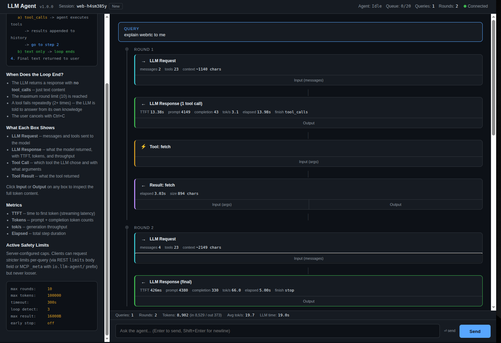
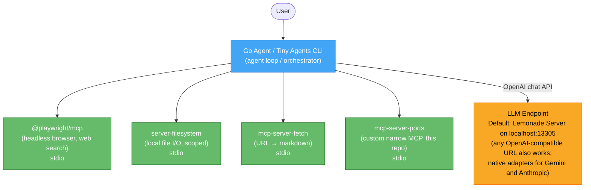
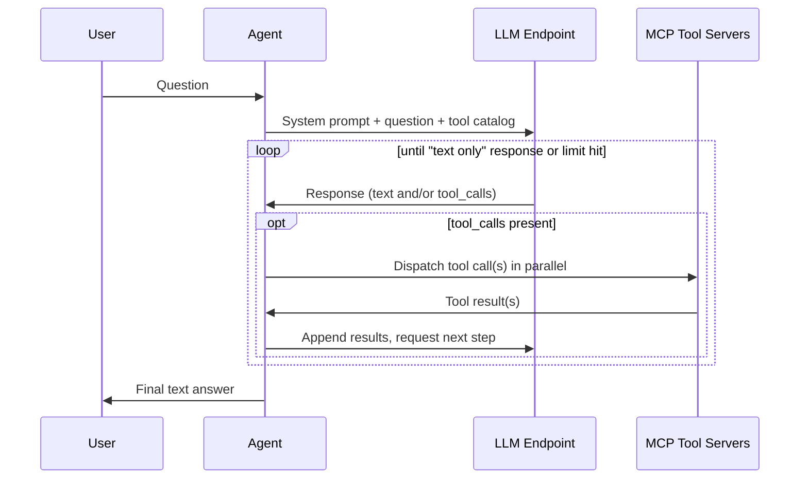
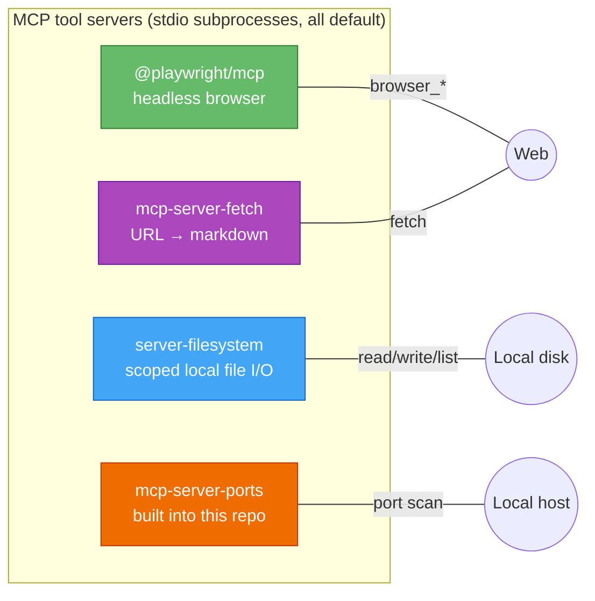
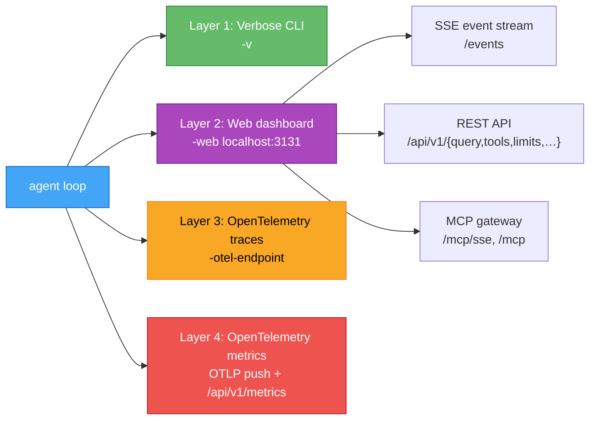

# llm-agent — A Portable, MCP-Driven AI Agent

<p align="center">
  
</p>

> A reference architecture for AI agents driven by [MCP](https://modelcontextprotocol.io/) tool servers. Runs fully private and offline against [Lemonade Server](https://github.com/lemonade-sdk/lemonade) on AMD hardware — no API keys, no recurring cost, no data leaving the machine — or against **any OpenAI-compatible endpoint** (LM Studio, Ollama, vLLM, llama.cpp, OpenAI, Groq, Together, Mistral, DeepSeek, …) with native adapters for **Google Gemini** and **Anthropic Claude** on top. Switch backends with one `-endpoint` flag; everything above the LLM (MCP tools, safety limits, observability, REST + MCP gateway) stays the same. Built to be **read and modified**, not just installed.

The project **is the Go agent** (`go-agent/`) — a single compiled binary, `llm-agent`, production-leaning: per-query safety limits with strict-only client overrides, OpenTelemetry traces and metrics (OTLP push + Prometheus pull), REST + MCP gateway, human-in-the-loop tool approvals, secret redaction in logs, live web dashboard with SSE event streaming, multi-provider LLM client with auto-detection.

The declarative `agent.json` config under `docs/` follows the [Hugging Face Tiny Agents](https://huggingface.co/blog/python-tiny-agents) format, so the same MCP setup can also be driven from `tiny-agents run ./docs/agent.json` if you have `huggingface_hub[mcp]` installed — handy for prototyping or comparing against the Go binary.

## Features at a glance

Fifteen things the Go agent (`llm-agent`) actually ships with — every one of them maps to code you can open and reason about.

**LLM & backend**
1. **Multi-provider client** — OpenAI-compatible HTTP plus **native Gemini** and **native Anthropic** adapters, auto-detected from the endpoint URL host.
2. **Streaming with TTFT** — token-by-token responses with time-to-first-token and token-rate measurement.
3. **Tool-call style auto-detection** — handles both native `tool_calls` and Qwen-style text-based `<function=...>` markup; per-server override in config.

**Agent loop**

4. **Per-query safety limits** with **strict-only client overrides** — max rounds, token budget, wall-clock timeout, loop fingerprinting, max result size, early stop. Callers can tighten, never loosen.
5. **Stable termination-reason enum** — `success`, `max_rounds`, `timeout`, `token_budget`, `loop_detected`, `tool_failures`, `terminal_error`, `user_cancel` — so callers branch on *why* a query stopped without grepping error strings.
6. **Human-in-the-loop tool approvals** — glob-pattern allowlist (`write_*`, `browser_*`, …), pauses dispatch, resolves via `POST /api/v1/approvals/{id}`, fail-safe deny on operator timeout.
7. **Parallel tool dispatch** within a round, per-tool timeout, and **JSON-Schema arg validation** against the MCP-declared `inputSchema` before dispatch.

**MCP & tools**

8. **Declarative `agent.json`** — env var substitution (`${HOME}`), per-server `allowTools` filter to shrink attack surface and context burn.
9. **Bundled narrow MCP example** (`mcp-servers/ports/`) — ~300 lines of Go, zero deps, stdio + SSE transports — as a template for your own domain tools.
10. **llms.txt** detection and caching, so the agent uses site-provided AI indexes when available instead of guessing.

**Observability — four composable layers**

11. **Verbose CLI** (`-v`), **live web dashboard + SSE event bus** (`-web`), **OpenTelemetry traces** via OTLP/HTTP, and **OpenTelemetry metrics with dual transport** — OTLP push *and* a Prometheus exposition at `/api/v1/metrics` — six instruments (counters + histograms for agent queries, LLM calls, tool calls).
12. **Secret redaction** — API keys and tokens are scrubbed from verbose logs and from the args field of approval events, so `-v` output is safe to paste.

**Surface for external callers**

13. **REST + MCP gateway** — synchronous, streaming, and async-job-queue endpoints, plus legacy SSE and Streamable HTTP MCP transports. The agent exposes itself as a tool (`agent_query`) other MCP clients can call.
14. **Per-IP token-bucket rate limiting** on mutating endpoints + **bounded async job queue**, so the agent stays stable under burst.
15. **Retry with jittered exponential backoff** — `retry.go` classifies which LLM errors are retriable (rate limit, transient network, 5xx) vs terminal (auth, quota), respects `Retry-After`, and jitters backoff so concurrent agents don't thunder a recovering provider.

## Why this project exists

Most "AI agent" tutorials assume a cloud LLM, an API key, and a credit card. This project shows you can do real, useful agent work — web research, reading and writing files, fetching URLs, calling custom tools — **entirely on your own hardware**, with no data leaving the machine and no recurring cost. And when you do want a cloud backend, swap the endpoint URL and keep everything else.

It's meant as a **reference architecture** rather than a polished product:

- The Go codebase is organized one concern per file (~7K LOC of production code across ~30 files, no framework magic). Every safety limit, every tool dispatch, every OpenTelemetry hook lives in a Go file you can open and reason about on its own.
- Production-minded extras (safety limits, traces, structured termination, job queue, approvals) exist so you can see what a serious local agent looks like — not as a finished product, but as a starting point you'd extend.

If you want a managed agent platform, this is not it. If you want to understand local AI agents end-to-end and customize them, you're in the right place.

## Companion blog series

A seven-part series on Substack walks through the design end-to-end: motivation, the MCP protocol and `agent.json` config, the agent loop and termination heuristics, a file-by-file walkthrough of every Go source file, operational notes, per-backend setup recipes, and the four observability layers — closing with the ten gaps you'd still close for production. Read the README to get it running; read the series to understand why it's built the way it is.

→ Start with **[Part 1 — Building a Portable AI Agent in Go](https://juergenfey.substack.com/p/building-a-portable-ai-agent-in-go)**.

## Architecture



The agent is the orchestrator. It speaks the OpenAI chat-completion API to the LLM endpoint and the [MCP protocol](https://modelcontextprotocol.io/) (JSON-RPC over stdio or SSE) to a collection of tool servers. Each MCP server is a subprocess spawned at startup; the agent merges their tool catalogs into one and presents them to the model. When the model emits a tool call, the agent dispatches it to the right server, returns the result, and loops until the model produces a final text answer.

This shape — one agent host, many tool subprocesses, one swappable LLM — is what makes the system composable. Adding a new capability (a database, a CI integration, a custom domain tool) is one line in `agent.json`. Switching from local to cloud LLM is one `-endpoint` flag.

## How the agent loop works



Three things end the loop, in priority order:

1. **Model returns text without tool calls** — natural completion.
2. **Safety limit hit** — max rounds, token budget, wall-clock timeout, repeated-tool-call fingerprint, terminal error from the LLM (auth, quota), or a tool that keeps failing.
3. **User cancels** with `Ctrl+C` (in interactive mode) or the context deadline fires (when called via REST with a request timeout).

Each termination reason is reported back to the caller as a stable enum string (`success`, `max_rounds`, `timeout`, `token_budget`, `loop_detected`, `tool_failures`, `terminal_error`, `user_cancel`), so callers can branch on *why* the loop stopped without grepping error messages.

## What is MCP, briefly

[**Model Context Protocol**](https://modelcontextprotocol.io/) is Anthropic's open standard for connecting LLM agents to tools. A server speaks JSON-RPC over stdio (or HTTP/SSE for remote use), exposes a list of named tools with JSON-schema-typed arguments, and returns results when called. The model never speaks MCP directly — the agent translates between the OpenAI tool-call format the model emits and the MCP tool calls the server expects.

Why MCP and not a hand-rolled tool interface:

- **Standard.** A growing ecosystem of MCP servers — Playwright, filesystem, fetch, GitHub, Slack, Postgres, and hundreds more — works out of the box.
- **Composable.** Each tool is a separate subprocess; one server can crash without taking the rest down.
- **Process-isolated.** The model never sees your code directly. A misbehaving tool can be killed, restarted, sandboxed, or scope-limited (`allowTools` filter in this project).
- **Declarative wiring.** `agent.json` lists what to spawn and with what arguments. No glue code per tool.

## Prerequisites

| Component | Version | Notes |
|---|---|---|
| Go | >= 1.26 | To build the Go agent |
| Python | >= 3.10 | Optional — only for the `tiny-agents` CLI |
| Node.js | >= 18 | For `npx` to spawn `@playwright/mcp` and `@modelcontextprotocol/server-filesystem` |
| uv | >= 0.4 | For `uvx` to spawn `mcp-server-fetch` |
| jq | optional | For `scripts/agent-cli.sh` pretty-printing |

For the **default quick-start path** (Lemonade Server, fully local):

| | |
|---|---|
| AMD hardware | Ryzen AI / Radeon |
| [Lemonade Server](https://github.com/lemonade-sdk/lemonade) | >= 7.0.2 (10.x recommended) |

For any **other backend** (LM Studio, vLLM, Ollama, llama.cpp, OpenAI, Groq, Gemini, Anthropic, etc.), you only need a reachable endpoint URL — no AMD hardware required. See [Choosing a backend](#choosing-a-backend) below.

## Quick start (default: Lemonade Server)

### 1. Validate prerequisites

```bash
chmod +x scripts/validate-setup.sh
./scripts/validate-setup.sh
```

Checks Node.js >= 18, `npx`, Python >= 3.10, `huggingface_hub[mcp]`, and a reachable Lemonade Server. Fix anything reported as missing before continuing. (Python + `huggingface_hub` only matter if you intend to use the `tiny-agents` CLI; for the Go agent alone, ignore those failures.)

### 2. Build the Go agent

```bash
cd go-agent
make build
```

Produces a single binary at `go-agent/llm-agent`. Also builds the bundled narrow MCP server (`mcp-servers/ports/mcp-server-ports`).

### 3. Start Lemonade Server

```bash
cd scripts
./start-lemonade.sh start              # starts server with 32K context + loads default model
```

This installs Lemonade if needed, starts it with `--ctx-size 32768`, downloads the default model (`Qwen3-Coder-30B-A3B-Instruct-GGUF`) on first run, and loads it into memory. Subsequent starts are fast — models are cached in `~/.cache/huggingface/`.

To use a different model:

```bash
./start-lemonade.sh start Qwen3-8B-GGUF
```

The 32K context is **mandatory** for tool use — the tool catalog alone consumes ~4K tokens, and you need room for conversation history and tool outputs.

### 4. Run the agent

In a separate terminal:

```bash
cd go-agent
./llm-agent
```

That's it. Type a question and the agent uses web browsing, file access, and URL fetching to answer.

**Recommended for a first run** — launch with verbose logging, streaming, and the web dashboard so you can watch the agent loop live in your browser:

```bash
./llm-agent -v -stream -web localhost:3131
```

Then open <http://localhost:3131> to see every LLM request, response, and tool call appear in real time as the agent works.

### CLI flags worth knowing

```bash
./llm-agent -v                          # verbose data-flow logs with token metrics + timing
./llm-agent -stream                     # streaming responses (enables TTFT measurement)
./llm-agent -web localhost:3131         # web dashboard + REST API + MCP gateway
./llm-agent -otel-endpoint localhost:4318   # OTLP traces + metrics push (Jaeger / Tempo / OTel Collector)
./llm-agent -endpoint <url>             # point at a different LLM backend (see below)
./llm-agent -model <name>               # override the model name
./llm-agent "your question"             # one-shot non-interactive mode
./llm-agent -version                    # print version and exit
```

Combine freely. The recommended "full observability" mode:

```bash
./llm-agent -v -stream -web localhost:3131 -otel-endpoint localhost:4318
```

You get colorized terminal logs, a live dashboard, an SSE event stream, Prometheus-scrapable metrics at `/api/v1/metrics`, and traces + metrics pushed to your OTel collector — all simultaneously.

### Tiny Agents CLI (optional)

The `docs/agent.json` config is in the [Hugging Face Tiny Agents](https://huggingface.co/blog/python-tiny-agents) format, so you can drive the same MCP servers from the `tiny-agents` CLI without building the Go binary at all:

```bash
pip install "huggingface_hub[mcp]>=0.33.2"
cd docs && tiny-agents run ./agent.json
```

Useful for quick prototyping or comparing the Go binary against a stripped-down "tiny" loop. None of the production extras (safety limits, observability, REST/MCP gateway, approvals) apply here — that's all in the Go agent.

## Choosing a backend

The Go agent talks to any LLM that supports the OpenAI chat-completion shape, plus native adapters for Gemini and Anthropic. The provider is auto-detected from the endpoint URL host; override with `-provider` if needed. The only thing that changes between backends is the URL (and an API key for cloud providers).

### Local backends (no API key)

```bash
# Lemonade (default)
./llm-agent

# LM Studio (default port 1234, OpenAI-compatible)
./llm-agent -endpoint http://localhost:1234/v1 -model "your-model-name"

# Ollama (default port 11434, OpenAI-compatible at /v1)
./llm-agent -endpoint http://localhost:11434/v1 -model "qwen3-coder:30b"

# vLLM
./llm-agent -endpoint http://localhost:8000/v1 -model "Qwen/Qwen3-8B"

# llama.cpp (with --server flag)
./llm-agent -endpoint http://localhost:8080/v1 -model "any"
```

All of these expose the OpenAI chat-completion API. The agent doesn't care which one is on the other end.

### OpenAI-compatible cloud providers (API key required)

```bash
# OpenAI
LLM_API_KEY=sk-... ./llm-agent -endpoint https://api.openai.com/v1 -model gpt-4o

# Groq (fast inference for open-weight models)
LLM_API_KEY=gsk_... ./llm-agent -endpoint https://api.groq.com/openai/v1 -model "llama-3.3-70b-versatile"

# Together AI
LLM_API_KEY=... ./llm-agent -endpoint https://api.together.xyz/v1 -model "..."

# Mistral, DeepSeek, etc. follow the same pattern
```

### Native-adapter providers (auto-detected from URL)

```bash
# Gemini (native adapter, translates OpenAI ↔ Gemini)
GEMINI_API_KEY=... ./llm-agent -endpoint https://generativelanguage.googleapis.com -model gemini-2.5-pro

# Anthropic (native adapter, translates OpenAI ↔ Messages API)
ANTHROPIC_API_KEY=... ./llm-agent -endpoint https://api.anthropic.com -model claude-sonnet-4-6
```

Once you've pointed `-endpoint` at any of these, everything else — MCP tool servers, safety limits, observability, REST API, MCP gateway — works identically. That's the swap-the-URL design: backends are interchangeable below the agent loop.

## What ships in the box



| Server | Package / source | Spawned via | Representative tools |
|---|---|---|---|
| Web browsing | [`@playwright/mcp`](https://github.com/playwright-community/mcp) | `npx` | `browser_navigate`, `browser_snapshot`, `browser_click`, `browser_type`, `browser_press_key`, `browser_take_screenshot` |
| Filesystem | [`@modelcontextprotocol/server-filesystem`](https://github.com/modelcontextprotocol/servers/tree/main/src/filesystem) | `npx` | `read_file`, `write_file`, `list_directory`, `search_files`, `move_file`, `create_directory` |
| URL fetch | [`mcp-server-fetch`](https://github.com/modelcontextprotocol/servers/tree/main/src/fetch) | `uvx` | `fetch` (HTML → clean markdown) |
| Port scanner | [`mcp-servers/ports/`](mcp-servers/ports/main.go) (this repo) | local Go binary | `list_listening_ports`, `check_port` |

The port scanner is a deliberately small worked example of how to build your own narrow MCP server in ~700 lines of Go with zero external dependencies. See [Extending — narrow MCP servers](#extending--narrow-mcp-servers) below.

### Recommended models for local use

| Model | Size | Speed | Quality | Best for |
|---|---|---|---|---|
| [Qwen3-Coder-30B-A3B-Instruct-GGUF](https://huggingface.co/Qwen/Qwen3-Coder-30B-A3B-Instruct-GGUF) | ~17 GB | Moderate | Excellent | Coding, complex reasoning, tool calling |
| [Qwen3-8B-GGUF](https://huggingface.co/Qwen/Qwen3-8B-GGUF) | ~5 GB | Fast | Good | General use, tool calling |
| [Qwen3-4B-GGUF](https://huggingface.co/Qwen/Qwen3-4B-GGUF) | ~3 GB | Very fast | Decent | Quick tasks, low VRAM |
| Llama-xLAM-2-8b-fc-r-Hybrid | ~5 GB | Fast | Good | Function calling |

All from the [Qwen3](https://github.com/QwenLM/Qwen3) family on [Hugging Face](https://huggingface.co/Qwen). The model must be loaded with **>= 32K context** for tool use; `scripts/start-lemonade.sh start` defaults to that.

The Go agent **auto-detects the tool-call style** per model family. Qwen models use the OpenAI-compatible `tool_calls` field via Lemonade's native style; some other model families (older Llama, Hermes, certain fine-tunes) emit text-based `<function=...>` markup that the agent parses in `toolparse.go`. Set `toolCallStyle` in `agent.json` to override (`auto`, `native`, or `text`).

## Production-ish polish

### Per-query safety limits

Local tool-using agents can spiral. A model keeps calling the same tool. A tool returns 5 MB of HTML. A query runs for an hour and burns the entire context window. The Go agent defends against each failure mode separately — so a single bug can't chain into all of them.

| Limit | What goes wrong without it | Default |
|---|---|---|
| Max tool rounds | Model loops "search → read → search → ..." until context overflows | 10 |
| Max token budget | Long queries silently burn billed tokens on commercial APIs | 100,000 |
| Wall-clock timeout (per query) | A hung tool freezes the agent indefinitely | 300 s |
| Per-tool timeout | One slow MCP call shouldn't consume the entire query budget | 60 s |
| Loop fingerprinting | Model calls exact same `(tool, args)` repeatedly | 3 repeats |
| Max result size | A 5 MB HTML fetch consumes the entire context on one call | 16,000 chars |
| Per-session history size | Long conversations grow unbounded and squeeze out context | ~80,000 chars (~20K tokens) |
| Recent turns kept on trim | Don't drop too much when the trimmer fires | 4 round-trips |
| Early stopping | Hard-limit hits return an error instead of a partial answer | opt-in |

Six of these are **per-query** limits that external callers (REST, MCP clients like CrewAI / AutoGen / LangGraph) can tighten per call: max rounds, max token budget, wall-clock timeout, loop fingerprinting, max result size, early stop. A quick `is port 13305 in use?` lookup asks for `timeout: 10`; a multi-step research task asks for `timeout: 600`. The server **clamps anything looser** than its configured defaults — clients cannot widen limits, only tighten them. See [`go-agent/README.md`](go-agent/README.md#per-query-safety-limits) for the full override API.

The remaining three (per-tool timeout, per-session history size, recent-turns-kept) are agent-level settings configured at startup. They bind the whole agent process, not individual queries.

### Observability — four independent layers



- **`-v`** prints every LLM request, response, tool call, and tool result to the terminal with colorized timing, TTFT, and token counts. Cheapest layer; usually enough to debug.
- **`-web <addr>`** exposes the dashboard, an SSE event stream at `/events`, a REST API for programmatic callers, and an MCP gateway so external MCP clients can drive the agent. The dashboard renders the agent loop visually as it happens.
- **`-otel-endpoint <addr>`** pushes traces and metrics in OTLP/HTTP format to a collector — Jaeger, Grafana Tempo, Honeycomb, or a plain OTel Collector that fans out to multiple backends. Each agent query produces a span tree (query → rounds → LLM calls + tool calls).
- **`/api/v1/metrics`** (enabled whenever `-web` is on) serves a Prometheus exposition with six instruments: counters and histograms for agent queries, LLM calls, and tool calls. Scrape it from your existing Prometheus and add alerts.

Any subset composes freely. They don't interfere with one another — each is an independent consumer of the same internal events and spans.

## REST + MCP gateway (when `-web` is on)

The Go agent exposes its own HTTP surface so external programs can drive it:

```
GET  /api/v1/health          # readiness + version + queue depth
GET  /api/v1/tools           # merged tool catalog from all MCP servers
GET  /api/v1/limits          # resolved per-query safety limits
GET  /api/v1/sessions        # active sessions
GET  /api/v1/metrics         # Prometheus exposition
POST /api/v1/query           # synchronous query
POST /api/v1/query/stream    # SSE event stream for one query
POST /api/v1/query/async     # job-queue submit, returns id; poll via /api/v1/jobs/{id}
POST /api/v1/approvals/{id}  # resolve a pending tool approval
GET  /events                 # global SSE event bus (every event from every query)

GET  /mcp/sse                # legacy SSE MCP transport
POST /mcp/message?sessionId=…  # legacy SSE message endpoint
POST /mcp                    # Streamable HTTP MCP transport (current spec)
```

The MCP gateway means **other MCP clients can use this agent as one of their tools.** An external client gets all the configured MCP tools plus a meta-tool `agent_query` that runs a full LLM loop. See [`go-agent/README.md`](go-agent/README.md#mcp-sse-gateway) for the protocol details.

The `agent-cli.sh` helper drives this surface from the command line — handy for testing without writing client code:

```bash
scripts/agent-cli.sh health
scripts/agent-cli.sh tools
scripts/agent-cli.sh query "your question"
scripts/agent-cli.sh stream "your question"   # live SSE events
scripts/agent-cli.sh metrics-summary
scripts/agent-cli.sh help
```

Target defaults to `http://localhost:3131`; override with `AGENT_URL=…`.

## Project structure

```
lemonade/
├── README.md                          ← you are here
├── llms.txt                           ← AI-friendly project index (llmstxt.org spec)
├── LICENSE
├── go-agent/                          ← Go agent (single binary)
│   │   Entry & orchestration
│   ├── main.go                       ← CLI entry, flags, signal handling, OTel wiring
│   ├── agent.go                      ← Agent struct, session table, startup context-size check
│   ├── session.go                    ← per-session state + the agent loop (LLM↔tool cycle)
│   │   Loop policy & helpers
│   ├── policy.go                     ← termination heuristics (terminal errors, tool failures)
│   ├── result.go                     ← QueryResult + Term* termination reasons
│   ├── limits.go                     ← per-query safety caps and clamping
│   ├── approval.go                   ← human-in-the-loop tool approval queue
│   ├── validate.go                   ← tool-arg schema validation before MCP dispatch
│   ├── util.go                       ← stateless helpers
│   │   LLM client + adapters
│   ├── llm.go                        ← provider dispatch, streaming, TTFT/token metrics
│   ├── retry.go                      ← backoff classifier
│   ├── gemini.go                     ← Google Gemini native adapter
│   ├── anthropic.go                  ← Anthropic native adapter
│   │   MCP layer
│   ├── mcp.go                        ← MCP server lifecycle, tool filtering, dispatch
│   ├── toolparse.go                  ← text-based tool-call parser (Qwen-style)
│   ├── llmstxt.go                    ← llms.txt detection and caching
│   │   Observability
│   ├── logger.go                     ← colorized verbose output (text + JSON modes)
│   ├── redact.go                     ← secret scrubbing
│   ├── events.go                     ← event types and pub/sub broadcaster
│   ├── otel.go                       ← OpenTelemetry tracing
│   ├── metrics.go                    ← OpenTelemetry metrics (OTLP push + Prometheus pull)
│   │   Web layer
│   ├── web.go                        ← HTTP scaffold + dashboard SSE
│   ├── web_types.go                  ← REST DTOs
│   ├── web_query.go                  ← REST query endpoints
│   ├── web_admin.go                  ← REST admin endpoints
│   ├── web_mcp.go                    ← MCP gateway (legacy SSE + Streamable HTTP)
│   ├── queue.go                      ← async job queue
│   ├── ratelimit.go                  ← per-IP token-bucket rate limiter
│   │   Config & static
│   ├── config.go                     ← config loading, provider/style detection
│   ├── static/index.html             ← dashboard UI (embedded via go:embed)
│   ├── agent.json                    ← default config
│   ├── PROMPT.md                     ← default system prompt
│   ├── Makefile                      ← build targets
│   └── README.md                     ← Go agent docs (deep dive)
├── mcp-servers/
│   └── ports/                        ← Reference narrow MCP server (port scanner)
├── scripts/
│   ├── start-lemonade.sh             ← Lemonade lifecycle (start/stop/config/pull/load/test)
│   ├── validate-setup.sh             ← pre-flight dependency checker
│   ├── agent-cli.sh                  ← curl wrapper for the running agent
│   ├── apply-license-headers.sh      ← license-header maintenance
│   ├── shutdown.sh                   ← graceful shutdown of agent + Lemonade
│   └── README.md                     ← scripts reference
└── docs/                             ← shared agent.json config + reference docs
    ├── agent.json                    ← Tiny Agents-format config (Linux/macOS)
    ├── agent-windows.json            ← Windows variant
    ├── PROMPT.md                     ← system prompt
    └── README.md
```

## Configuration

### Swap the model

Edit `model` in the agent's `agent.json` (or use the `-model` flag):

```json
{
  "model": "Qwen3-8B-GGUF",
  ...
}
```

### Restrict filesystem access

The default filesystem server is scoped to `.` (the directory the agent is launched from) and `~/Documents`. Tighten that to a single sandbox path:

```json
"args": ["-y", "@modelcontextprotocol/server-filesystem", "/your/sandbox"]
```

### Filter tools per MCP server (`allowTools`)

The Go agent supports an allowlist so you only expose what you actually want the model to use — fewer tools means less context burn and lower latency, plus reduced attack surface:

```json
{
  "config": {
    "command": "npx",
    "args": ["-y", "@playwright/mcp@latest", "--headless"],
    "allowTools": ["browser_navigate", "browser_snapshot", "browser_click"]
  }
}
```

### Require approval for sensitive tools

Glob-pattern allowlist that pauses matching tool calls until an operator resolves them via `POST /api/v1/approvals/{id}`. The agent emits an `approval_request` event so a human (or external policy engine) can decide:

```json
{
  "requireApproval": ["write_*", "edit_*", "move_*"]
}
```

### Tune safety limits server-side

All limits documented above are configurable at the top level of `agent.json`. See [`go-agent/README.md`](go-agent/README.md#per-query-safety-limits) for the camelCase ↔ snake_case mapping (server-side `maxToolRounds` ↔ per-query override `max_rounds`, etc.).

### Add more MCP servers

Append to the `servers` array in `agent.json`. The community catalog at [mcpservers.org](https://mcpservers.org) and [awesome-mcp-servers](https://github.com/punkpeye/awesome-mcp-servers) lists hundreds — GitHub, GitLab, Slack, Postgres, SQLite, Memory, AWS, Brave Search, Notion, Linear, and more.

## Extending — narrow MCP servers

Big general-purpose MCP servers (filesystem, browser) are convenient. **Narrow** servers — one task, two or three tools, zero dependencies — are what you'll mostly write for your own systems. They surface less context to the model, are easier to audit, and compose cleanly with the broader catalog.

The bundled [`mcp-servers/ports/`](mcp-servers/ports/main.go) is a worked example: ~700 lines of Go, two tools (`list_listening_ports`, `check_port`), supports both stdio (default) and SSE (`-sse :4100`) transports, zero external dependencies. Use it as a template for your own narrow servers — replace the port-scanning logic with whatever your domain needs, keep the protocol scaffolding.

The pattern: each tool gets a `name`, an `inputSchema` (JSON Schema), a `description` written for the *model*, and a handler. Register tools on a `mcp.Server`, serve over stdio, done.

## Troubleshooting

| Problem | Fix |
|---|---|
| `exceeds the available context size` | Restart Lemonade with larger context: `./scripts/start-lemonade.sh config ctx-size 32768` |
| Model doesn't call tools | Use a tool-calling model (Qwen3 family, Llama-xLAM). Verify Lemonade >= 7.0.2 |
| Slow first response | Model is loading into memory. Pre-load with `start-lemonade.sh start` |
| `npx` hangs on Windows | Use `docs/agent-windows.json` with full `npx.cmd` paths |
| Server won't start | Check if port 13305 is in use: `lsof -i :13305` |
| Streaming returns empty | Context too small for tool catalog. Bump `ctx-size` or use a smaller toolset via `allowTools` |
| `connection refused` on `4318` | You set `-otel-endpoint localhost:4318` but no OTel collector is running. Drop the flag or start a collector (e.g., `docker run -p 4318:4318 -p 16686:16686 jaegertracing/all-in-one`) |
| Permission denied on script | `chmod +x scripts/<name>.sh` |

## References

| Resource | Link |
|---|---|
| Lemonade Server | [GitHub](https://github.com/lemonade-sdk/lemonade) / [Docs](https://lemonade-server.ai/docs/server/) / [Model Gallery](https://lemonade-server.ai/models.html) / [API Spec](https://lemonade-server.ai/docs/server/server_spec/) |
| Hugging Face Tiny Agents | [Blog](https://huggingface.co/blog/python-tiny-agents) |
| Playwright MCP | [GitHub](https://github.com/playwright-community/mcp) |
| MCP Servers (community) | [GitHub](https://github.com/modelcontextprotocol/servers) |
| MCP Specification | [modelcontextprotocol.io](https://modelcontextprotocol.io/) / [GitHub](https://github.com/modelcontextprotocol/modelcontextprotocol) |
| Qwen3 Models | [GitHub](https://github.com/QwenLM/Qwen3) / [Hugging Face](https://huggingface.co/Qwen) |
| AMD Tiny Agents Article | [amd.com](https://www.amd.com/en/developer/resources/technical-articles/2025/local-tiny-agents--mcp-agents-on-ryzen-ai-with-lemonade-server.html) |
| HF MCP Course | [huggingface.co](https://huggingface.co/learn/mcp-course/en/unit2/lemonade-server) |
| MCP Server Directory | [mcpservers.org](https://mcpservers.org) / [awesome-mcp-servers](https://github.com/punkpeye/awesome-mcp-servers) |
| Blog series (this project) | [*Building a Local AI Agent in Go* on Substack](https://juergenfey.substack.com/p/building-a-portable-ai-agent-in-go) |

## License

Apache License 2.0 — see [LICENSE](LICENSE) for the full text. Individual component licenses (MCP servers, models) apply to those components.

---

<p align="center">Made with ❤️</p>
