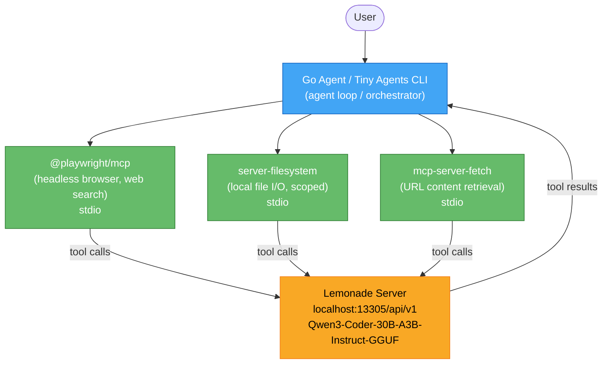
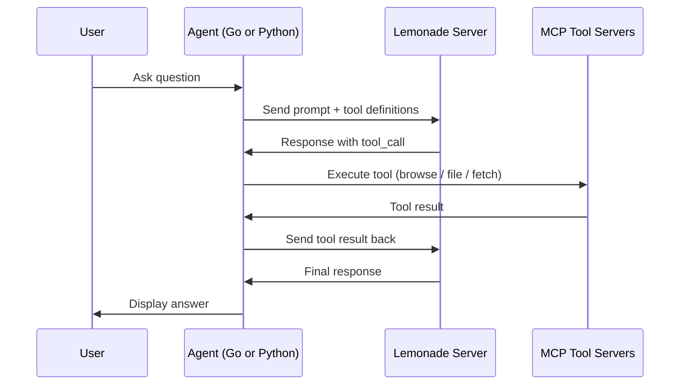
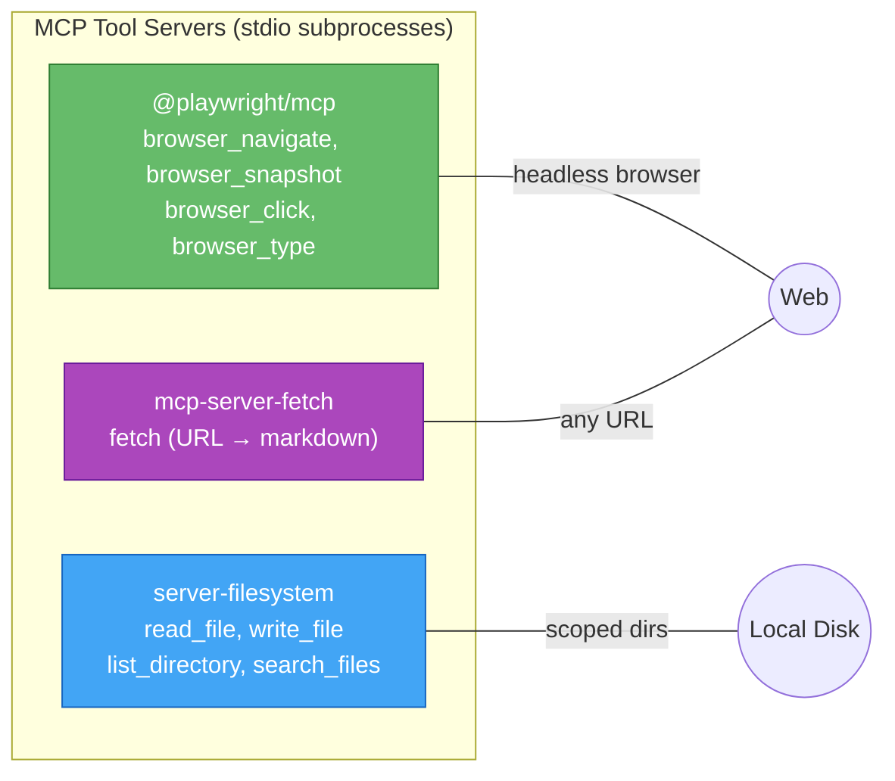

# Lemonade + MCP: Fully Local AI Agent with Web Search & File Access

Run a fully private AI agent on your machine. Combines [Lemonade Server](https://github.com/lemonade-sdk/lemonade) for local LLM inference with [MCP](https://modelcontextprotocol.io/) tool servers (web browsing, filesystem, URL fetch).

Two agent implementations, same config format:
- **Go** -- single compiled binary with verbose logging, OpenTelemetry tracing, and streaming (`go-agent/`)
- **Python** -- [Hugging Face Tiny Agents](https://huggingface.co/blog/python-tiny-agents) (`docs/`)

**No API keys required.** Everything runs locally -- your conversations never leave the device.

## Architecture



## Why this project

Most "AI agent" tutorials assume a cloud LLM, an API key, and a credit card. This project shows you can do real, useful agent work -- web research, reading and writing files, fetching URLs, calling custom tools -- entirely on your own hardware, with **no data leaving the machine** and **no recurring cost**.

It is meant as a **reference architecture** rather than a polished product:

- A small Go binary (`go-agent/`) that speaks the OpenAI chat API, drives any [MCP](https://modelcontextprotocol.io/) tool server over stdio or SSE, and exposes a live web dashboard for inspecting the agent loop.
- A Python equivalent (`docs/`) using [Hugging Face Tiny Agents](https://huggingface.co/blog/python-tiny-agents) for quick prototyping with the same `agent.json` config format.
- Production-minded extras: per-query safety limits, OpenTelemetry tracing, streaming with TTFT metrics, model-specific tool-call style detection, and a job queue for async REST/MCP clients.

If you want to understand local AI agents end-to-end -- protocol, loop, codebase, operations -- this repo is designed to be read and modified, not just installed.

## Blog series

For the *why* behind this codebase — protocol design, agent-loop trade-offs, observability layers, multi-backend portability — there's a companion blog series, *Building a Local AI Agent in Go*. Start with [Part 1: Introduction & Motivation](https://juergenfey.substack.com/p/building-a-portable-ai-agent-in-go) on Substack; the rest of the series links from there.

Read the README to get it running; read the series to understand *why* it's built the way it is.

## Prerequisites

| Component | Version | Link |
|---|---|---|
| AMD hardware | Ryzen AI / Radeon | Required for Lemonade Server |
| Lemonade Server | >= 7.0.2 | [GitHub](https://github.com/lemonade-sdk/lemonade) / [Docs](https://lemonade-server.ai/docs/server/) |
| Python | >= 3.10 | [python.org](https://www.python.org/) or [pyenv](https://github.com/pyenv/pyenv) |
| Node.js | >= 18 | [nodejs.org](https://nodejs.org/) or `nvm install 18` |
| uv | >= 0.4 | [docs.astral.sh](https://docs.astral.sh/uv/) (for uvx to spawn mcp-server-fetch) |

No API keys needed. Web search uses a headless browser via [@playwright/mcp](https://github.com/playwright-community/mcp).

## Quick Start

### 1. Clone the repo

```bash
git clone <repo-url>
cd lemonade
```

### 2. Validate prerequisites

```bash
chmod +x scripts/validate-setup.sh
./scripts/validate-setup.sh
```

Checks for Node.js >= 18, Python >= 3.10, `npx`, `uv`, and (for the Python agent) `huggingface_hub[mcp]`. Fix anything reported as missing before continuing.

### 3. Build the Go agent

```bash
cd go-agent
make build
```

### 4. Start Lemonade Server

```bash
cd ../scripts
chmod +x start-lemonade.sh
./start-lemonade.sh start              # starts server (32K context) + loads default model
```

This installs Lemonade Server if needed, starts it with `--ctx-size 32768`, downloads and loads the default model (`Qwen3-Coder-30B-A3B-Instruct-GGUF`). Models are cached in `~/.cache/huggingface/` -- subsequent starts are fast.

To use a different model:
```bash
./start-lemonade.sh start Qwen3-8B-GGUF
```

### 5. Run the agent

In a separate terminal:

```bash
cd go-agent
./llm-agent                    # interactive mode
```

That's it. Type a question and the agent will use web browsing, file access, and URL fetching to answer.

**Recommended for a first test run** -- launch with verbose logging, streaming, and the web dashboard so you can watch the agent loop in your browser:

```bash
./llm-agent -v --stream --web localhost:3131
```

Then open <http://localhost:3131> to inspect every request, response, and tool call live.

### Optional flags

```bash
./llm-agent -v                        # verbose -- see data flow, token metrics, timing
./llm-agent -v --stream               # streaming with TTFT measurement
./llm-agent -v --web localhost:3131   # web dashboard at http://localhost:3131
./llm-agent -v --stream --web localhost:3131   # all of the above (recommended for first run)
./llm-agent "your question"           # single query mode (non-interactive)
```

### Python alternative

```bash
pip install "huggingface_hub[mcp]>=0.33.2"
cd docs && tiny-agents run ./agent.json
```

## Agent Tool Flow



## Recommended Models

| Model | Size | Speed | Quality | Best For |
|---|---|---|---|---|
| [Qwen3-Coder-30B-A3B-Instruct-GGUF](https://huggingface.co/Qwen/Qwen3-Coder-30B-A3B-Instruct-GGUF) | ~17 GB | Moderate | Excellent | Coding, complex reasoning |
| [Qwen3-8B-GGUF](https://huggingface.co/Qwen/Qwen3-8B-GGUF) | ~5 GB | Fast | Good | General use, tool calling |
| [Qwen3-4B-GGUF](https://huggingface.co/Qwen/Qwen3-4B-GGUF) | ~3 GB | Very fast | Decent | Quick tasks, low VRAM |
| Llama-xLAM-2-8b-fc-r-Hybrid | ~5 GB | Fast | Good | Function calling |

All models from the [Qwen3](https://github.com/QwenLM/Qwen3) family on [Hugging Face](https://huggingface.co/Qwen).

**Important:** The model must be loaded with **>= 32K context** for tool use. The tool schemas consume ~4K tokens. Use `scripts/start-lemonade.sh start` which sets `--ctx-size 32768` by default.

## MCP Servers



| Server | Package | Spawned via | Tools | Link |
|---|---|---|---|---|
| Web Browsing | `@playwright/mcp` | `npx` | `browser_navigate`, `browser_snapshot`, `browser_click`, `browser_type`, `browser_press_key`, `browser_take_screenshot` | [GitHub](https://github.com/playwright-community/mcp) |
| Filesystem | `@modelcontextprotocol/server-filesystem` | `npx` | `read_file`, `write_file`, `list_directory`, `search_files`, etc. | [GitHub](https://github.com/modelcontextprotocol/servers/tree/main/src/filesystem) |
| Fetch | `mcp-server-fetch` | `uvx` | `fetch` (HTML to markdown) | [GitHub](https://github.com/modelcontextprotocol/servers/tree/main/src/fetch) |

## Project Structure

```
lemonade/
├── README.md                          ← you are here
├── CLAUDE.md                          ← Claude Code project instructions
├── go-agent/                          ← Go agent (single binary)
│   │   Entry & orchestration
│   ├── main.go                       ← CLI entry, flags, signal handling, initTracer + initMetrics
│   ├── agent.go                      ← Agent struct, session table, startup context-size check
│   ├── session.go                    ← per-session conversation state + the agent loop
│   │   Loop policy & helpers
│   ├── policy.go                     ← termination heuristics (isTerminalError, isToolFailure)
│   ├── result.go                     ← QueryResult + Term* termination reasons
│   ├── limits.go                     ← per-query safety caps (rounds, tokens, timeout, …)
│   ├── approval.go                   ← human-in-the-loop tool approval queue
│   ├── validate.go                   ← tool-arg schema validation before MCP dispatch
│   ├── util.go                       ← stateless helpers (truncateLog, historySize, …)
│   │   LLM client + adapters
│   ├── llm.go                        ← provider dispatch, streaming, TTFT/token metrics
│   ├── retry.go                      ← backoff classifier (which errors retry)
│   ├── gemini.go                     ← Google Gemini API adapter
│   ├── anthropic.go                  ← Anthropic Claude API adapter
│   │   MCP layer
│   ├── mcp.go                        ← MCP server lifecycle, tool filtering, dispatch
│   ├── toolparse.go                  ← text-based tool call parser (Qwen-style)
│   ├── llmstxt.go                    ← llms.txt detection and caching
│   │   Observability
│   ├── logger.go                     ← colorized verbose output (text + JSON modes)
│   ├── redact.go                     ← secret scrubbing on log paths
│   ├── events.go                     ← event types and pub/sub broadcaster
│   ├── otel.go                       ← OpenTelemetry tracing (OTLP HTTP)
│   ├── metrics.go                    ← OpenTelemetry metrics (OTLP push + Prometheus pull)
│   │   Web layer
│   ├── web.go                        ← HTTP scaffold + dashboard SSE
│   ├── web_types.go                  ← request/response DTOs
│   ├── web_query.go                  ← REST query endpoints (/query, /stream, /async)
│   ├── web_admin.go                  ← REST admin (/tools, /limits, /sessions, /approvals, /metrics)
│   ├── web_mcp.go                    ← MCP gateway (legacy SSE + Streamable HTTP)
│   ├── queue.go                      ← job queue for async API requests
│   ├── ratelimit.go                  ← per-IP token-bucket rate limiter
│   │   Config & static
│   ├── config.go                     ← config loading, provider/style detection
│   ├── static/index.html             ← dashboard UI (embedded in binary)
│   ├── agent.json                    ← default config (Playwright + filesystem + fetch + ports)
│   ├── PROMPT.md                     ← system prompt
│   ├── Makefile                      ← build targets (deps, vet, build, test, mcp-test, run, query)
│   └── README.md                     ← Go agent docs (comprehensive)
├── mcp-servers/                       ← Custom narrow MCP servers
│   └── ports/                        ← Port scanner (stdio + SSE transports)
├── scripts/                           ← Server management & utilities
│   ├── start-lemonade.sh             ← server management (start/stop/config/pull/load/test)
│   ├── validate-setup.sh             ← pre-flight dependency checker
│   ├── agent-cli.sh                  ← curl wrapper for a running agent (health, query, metrics, …)
│   ├── apply-license-headers.sh      ← license-header maintenance utility
│   └── agent_demo.py                 ← programmatic Python example
└── docs/                              ← Python agent (Tiny Agents) variant
    ├── agent.json                     ← Python agent config
    ├── agent-windows.json             ← Windows variant
    ├── PROMPT.md                      ← system prompt for the Python agent
    └── README.md                      ← Python agent quick reference
```

## Go Agent Features

The Go agent (`go-agent/`) provides capabilities beyond the Python variant:

| Feature | Description |
|---|---|
| Verbose mode (`-v`) | Colorized data flow: requests, responses, tool calls, timing |
| Web dashboard (`--web`) | Real-time browser UI visualizing the agent loop with clickable I/O inspection |
| REST API (`--web`) | Sync, streaming, and async query endpoints with job queue for external integration |
| MCP SSE gateway (`--web`) | External MCP clients (CrewAI, AutoGen, LangGraph) connect via `/mcp/sse` to use all tools |
| LLM metrics | TTFT, prompt/completion tokens, tok/s per request |
| OpenTelemetry traces | Export to Jaeger, Grafana Tempo, etc. via `--otel-endpoint` |
| OpenTelemetry metrics | Six instruments (agent / LLM / tool counters + histograms) over OTLP push *and* Prometheus pull (`/api/v1/metrics`) |
| HITL approval (`requireApproval`) | Glob-pattern allowlist that pauses matching tools until an operator resolves via `POST /api/v1/approvals/{id}` |
| Tool-arg validation | Per-tool `inputSchema` enforced in-process before MCP dispatch — bad calls fail same round, not after a subprocess round-trip |
| Streaming | Opt-in streaming API with `--stream` for TTFT metrics |
| Model compatibility | Auto-detects tool call style (native vs text) per model family |
| Tool filtering | `allowTools` in config to whitelist tools per MCP server |
| Context detection | Queries llamacpp backend at startup, warns if context is too small |
| Signal handling | Ctrl+C cancels current query; second Ctrl+C exits |
| llms.txt support | Auto-fetches AI-optimized site summaries (`auto`, `prefer`, `ignore` modes) |
| Multi-provider | OpenAI-compatible, Google Gemini, and Anthropic Claude via native adapters |
| API key support | Config, CLI flag (`-api-key`), or env vars (`LLM_API_KEY`, `OPENAI_API_KEY`, etc.) |
| Loop safety | Token budget, wall-clock timeout, loop fingerprinting, terminal error classification |
| Early stopping | `--early-stop`: synthesize a final answer when hard limits hit, instead of erroring |
| Failure detection | Stops retrying tools that fail repeatedly |
| Per-query limits | REST API `limits` body field and MCP `_meta` (`io.llm-agent/*`) for stricter-only per-call overrides |

### Why Safety Limits Exist

Local tool-using agents can spiral: a model keeps calling the same tool, a tool returns 5 MB of HTML, a query runs for an hour and burns the context window. The Go agent defends against each failure mode separately, so a single bug can't chain into all of them:

| Limit | What goes wrong without it | Default |
|---|---|---|
| **Max tool rounds** | Model loops "search → read → search → ..." until context overflows | 10 |
| **Max token budget** | Long queries silently rack up thousands of billed tokens on commercial APIs | 100000 |
| **Wall-clock timeout** (per query) | A hung tool (stuck browser, slow network) freezes the agent indefinitely | 300s |
| **Per-tool timeout** | One slow MCP call shouldn't be allowed to consume the entire query budget | 60s |
| **Loop fingerprinting** | Model calls the exact same `(tool, args)` pair over and over | 3 repeats |
| **Max result size** | A 5 MB HTML fetch consumes the entire context window on one call | 16000 chars |
| **Per-session history size** | Long conversations grow unbounded and silently squeeze out the context window | 80000 chars (~20K tokens) |
| **Recent turns kept on trim** | Trimming the lot would drop necessary context; keep the last few user/assistant pairs | 4 round-trips |
| **Early stopping** | Hard-limit hits error out instead of returning a partial answer | opt-in |

**Per-query vs session-level.** Six of these are *per-query* limits that external callers (REST, MCP clients like CrewAI/AutoGen) can tighten per call: max tool rounds, max token budget, wall-clock timeout, loop fingerprinting, max result size, and early stopping -- e.g. a quick `is port 13305 in use?` lookup asks for `timeout: 10`, a research task asks for `timeout: 600`. The server clamps anything looser than its configured defaults; clients cannot widen limits. The other three -- per-tool timeout, per-session history size, and recent-turns-kept-on-trim -- are *session/agent-level* defaults applied uniformly and not per-query overridable. See [go-agent/README.md § Per-Query Safety Limits](go-agent/README.md#per-query-safety-limits) for the full API.

See [go-agent/README.md](go-agent/README.md) for full documentation.

## Server Management

The `start-lemonade.sh` script wraps all `lemonade-server` subcommands:

```bash
scripts/start-lemonade.sh start [model]         # start server + load model
scripts/start-lemonade.sh stop                   # graceful shutdown
scripts/start-lemonade.sh status                 # health + loaded model
scripts/start-lemonade.sh list                   # available models
scripts/start-lemonade.sh pull <model>           # download model (cached)
scripts/start-lemonade.sh load <model>           # load/switch model
scripts/start-lemonade.sh config ctx-size 32768  # change context (restarts server)
scripts/start-lemonade.sh test                   # smoke tests
```

Models are cached in `~/.cache/huggingface/` and persist across server restarts.

Once the agent is running with `-web`, the `agent-cli.sh` helper drives its HTTP surface from the command line:

```bash
scripts/agent-cli.sh health                           # liveness + loaded model
scripts/agent-cli.sh tools                            # list MCP tools
scripts/agent-cli.sh limits                           # resolved per-query safety limits
scripts/agent-cli.sh sessions                         # active sessions
scripts/agent-cli.sh query "your question"            # synchronous query
scripts/agent-cli.sh stream "your question"           # live SSE events for one query
scripts/agent-cli.sh events [type]                    # tail /events, optional type filter
scripts/agent-cli.sh metrics                          # raw Prometheus exposition
scripts/agent-cli.sh metrics-summary                  # parsed counters + histogram sums
scripts/agent-cli.sh help                             # full reference
```

Default target is `http://localhost:3131`; override with `AGENT_URL=…`. Requires `jq` for pretty-printing.

## Configuration

### Change the default model

Edit `agent.json` (in `docs/` or `go-agent/`):
```json
{
  "model": "Qwen3-8B-GGUF",
  ...
}
```

### Restrict filesystem access

Edit the filesystem server `args` in `agent.json`:
```json
"args": ["-y", "@modelcontextprotocol/server-filesystem", "/only/this/path"]
```

### Filter tools per MCP server

The Go agent supports `allowTools` to limit which tools are exposed:
```json
{
  "config": {
    "command": "npx",
    "args": ["-y", "@playwright/mcp@latest", "--headless"],
    "allowTools": ["browser_navigate", "browser_snapshot", "browser_click"]
  }
}
```

### Add more MCP servers

Append to the `servers` array in `agent.json`. Browse available servers at [mcpservers.org](https://mcpservers.org) or [awesome-mcp-servers](https://github.com/punkpeye/awesome-mcp-servers).

## Troubleshooting

| Problem | Solution |
|---|---|
| `exceeds the available context size` | Restart server with larger context: `./start-lemonade.sh config ctx-size 32768` |
| Model doesn't call tools | Use a tool-calling model ([Qwen3](https://github.com/QwenLM/Qwen3), Llama-xLAM). Check Lemonade >= 7.0.2 |
| Slow first response | Model is loading. Pre-load with `start-lemonade.sh start` |
| npx hangs on Windows | Use `agent-windows.json` with full `npx.cmd` paths |
| Server won't start | Check if port 13305 is already in use: `lsof -i :13305` |
| Streaming returns empty | Context too small (check verbose output). Use `--stream` for diagnostics |

## References

| Resource | Link |
|---|---|
| Lemonade Server | [GitHub](https://github.com/lemonade-sdk/lemonade) / [Docs](https://lemonade-server.ai/docs/server/) / [CLI Reference](https://lemonade-server.ai/docs/server/lemonade-server-cli/#options-for-serve-and-run) / [Model Gallery](https://lemonade-server.ai/models.html) / [Custom Models](https://lemonade-server.ai/docs/server/custom-models/#template) / [API Spec](https://lemonade-server.ai/docs/server/server_spec/) |
| Hugging Face Tiny Agents | [Blog](https://huggingface.co/blog/python-tiny-agents) / [PyPI](https://pypi.org/project/huggingface-hub/) |
| Playwright MCP | [GitHub](https://github.com/playwright-community/mcp) |
| MCP Servers (Anthropic) | [GitHub](https://github.com/modelcontextprotocol/servers) |
| MCP Specification | [modelcontextprotocol.io](https://modelcontextprotocol.io/) / [GitHub](https://github.com/modelcontextprotocol/modelcontextprotocol) |
| Qwen3 Models | [GitHub](https://github.com/QwenLM/Qwen3) / [Hugging Face](https://huggingface.co/Qwen) |
| AMD Tiny Agents Article | [amd.com](https://www.amd.com/en/developer/resources/technical-articles/2025/local-tiny-agents--mcp-agents-on-ryzen-ai-with-lemonade-server.html) |
| HF MCP Course | [huggingface.co](https://huggingface.co/learn/mcp-course/en/unit2/lemonade-server) |
| MCP Server Directory | [mcpservers.org](https://mcpservers.org) / [awesome-mcp-servers](https://github.com/punkpeye/awesome-mcp-servers) |
| LLM Server Migration | [tool-migration.md](docs/tool-migration.md) -- using LM Studio, Ollama, or vLLM instead of Lemonade |

## License

See individual component licenses. This repository contains configuration and documentation only.
