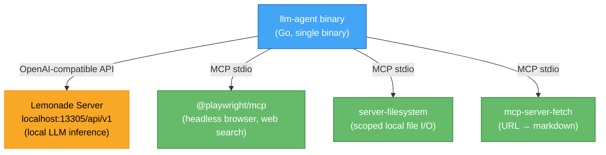
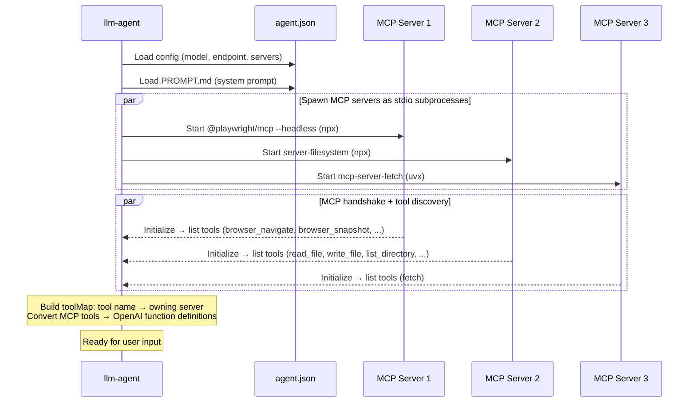
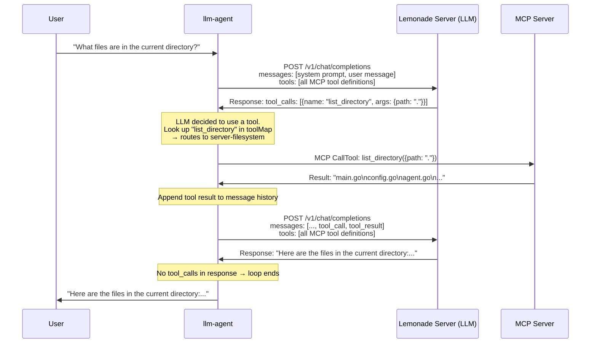
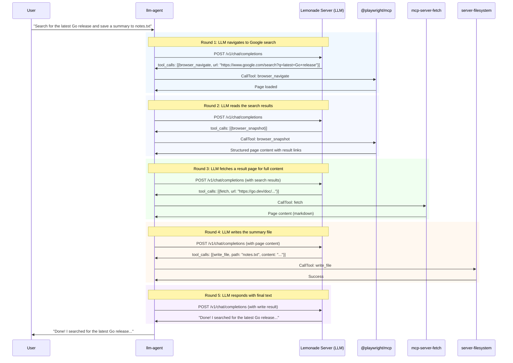
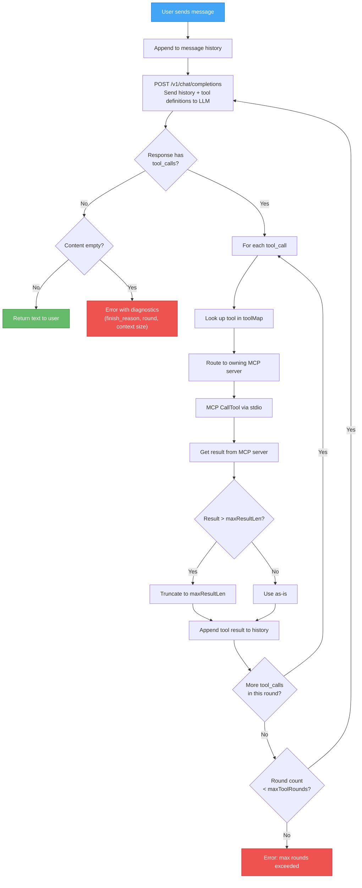
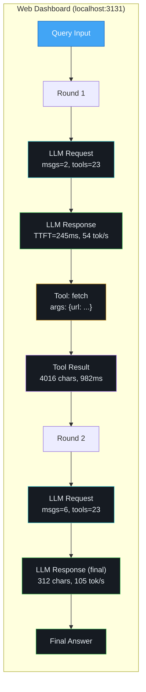
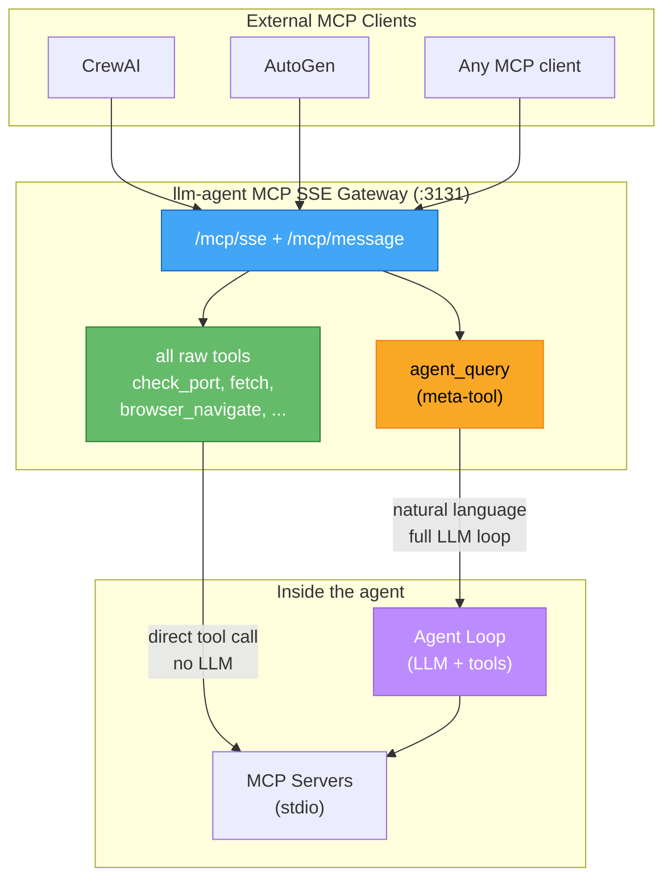
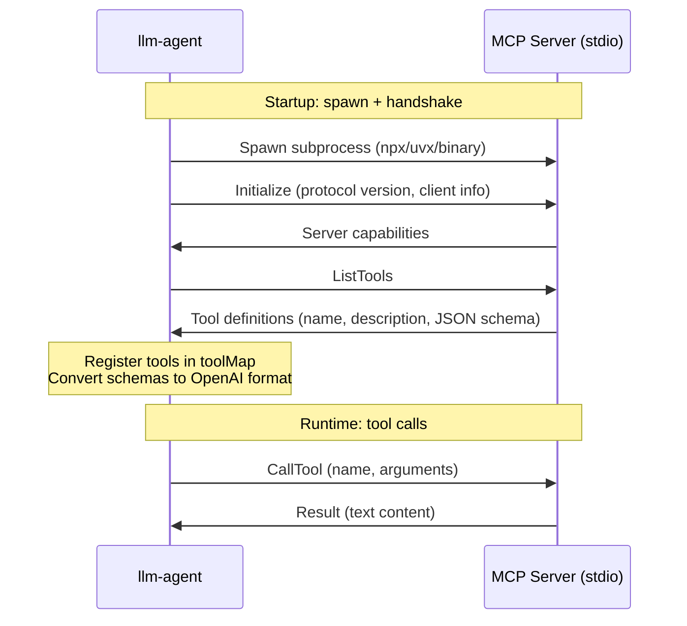

# LLM Agent (Go)

A Go-based AI agent that connects to any LLM backend and uses [MCP](https://modelcontextprotocol.io/) tool servers for web search, file access, and URL fetching.

Supported backends:
- **Local** (no API key): [Lemonade Server](https://github.com/lemonade-sdk/lemonade), [LM Studio](https://lmstudio.ai/), [vLLM](https://docs.vllm.ai/), [Ollama](https://ollama.com/), or any OpenAI-compatible endpoint
- **Commercial**: [OpenAI](https://platform.openai.com/) (GPT-4o), [Anthropic](https://docs.anthropic.com/) (Claude), [Google Gemini](https://ai.google.dev/), [Groq](https://groq.com/), [Together AI](https://together.ai/), [Mistral](https://mistral.ai/), [DeepSeek](https://deepseek.com/)

See [tool-migration.md](../docs/tool-migration.md) for backend-specific setup.

## Scope & Positioning

This is a **reference-quality local agent with production-ish polish** -- intended to be a readable, single-binary reference implementation rather than a managed platform. Compared to typical production agent systems:

- **Ahead of** most OSS reference agents on safety limits (per-query token/time/loop caps with stricter-only client overrides), observability (OTEL + SSE dashboard + structured termination), and multi-provider support with native adapters.
- **Comparable to** HuggingFace Tiny Agents or a hand-rolled `openai`-based agent on core loop features.
- **Behind platforms** (LangGraph, OpenAI Assistants, Claude Code, CrewAI) on durable state, multi-user isolation, RAG integration, and multi-agent orchestration. Some of those gaps are intentional scope boundaries; others are on the roadmap below.

### Roadmap

**Tier 1 -- shipped.** REST session/thread isolation, bounded per-session history with auto-trim, per-tool timeout, parallel tool execution, LLM retry/backoff on transient errors.

**Tier 2 -- shipped.** Secret redaction in logs/events/traces, tool-argument schema validation, cost tracking with pricing table, REST/MCP rate limiting, human-in-the-loop tool approval, structured JSON log format, MCP Streamable HTTP transport (stateless subset).

**Tier 3 -- intentionally out of scope for this project:**
- Durable checkpointing / time-travel debugging
- Multi-user authentication and per-user quotas
- Built-in RAG / vector store
- Built-in code execution sandbox
- Multi-agent orchestration beyond the MCP `agent_query` primitive

Each shipped feature has tests (unit + race-checked) and is documented in the relevant section below.

## Architecture



## How It Works

The agent acts as an orchestrator between the user, a local LLM, and MCP tool servers. The LLM never communicates with the tools directly -- all routing goes through the Go agent binary.

### Startup Sequence

On launch, the agent goes through a bootstrap phase before accepting user input:



**What happens at startup** (`main.go` → `NewAgent` → `MCPManager.StartServers`):

1. **Config loading** (`config.go`): Reads `agent.json`, expands `${HOME}` and other env vars, normalizes the endpoint URL to end with `/v1`, loads `PROMPT.md` as the system prompt.
2. **MCP server launch** (`mcp.go`): Each server entry spawns a subprocess via its `command` + `args`. The agent opens an MCP stdio transport to each process.
3. **MCP handshake**: Sends an `Initialize` request with protocol version and client info, then calls `ListTools` to discover what each server offers.
4. **Tool registration**: Builds a `toolMap` (tool name → server) so it knows where to route calls. Converts all MCP tool schemas into OpenAI-compatible function definitions for the LLM.

### Agent Loop (LLM ↔ Tool Cycle)

Once running, every user query enters the agent loop -- a back-and-forth between the LLM and tools that continues until the LLM produces a final text answer:



### Multi-Tool Example

The LLM can chain multiple tools across multiple rounds. For example, "Search for the latest Go release and save a summary to notes.txt":



### Agent Loop Flowchart

The loop logic in `agent.go` as a flowchart:



### How the Loop Ends

The core decision is `hasToolCalls := len(msg.ToolCalls) > 0`. When false, the loop exits. In practice, there are ten distinct termination paths across three categories:

**Success paths:**

| # | Exit | Trigger | Outcome |
|---|---|---|---|
| 1 | **Success** | LLM returns text with no tool calls | Return answer |
| 2 | **Early-stop synthesis** | `-early-stop` enabled + any hard-limit hit | Final tools-disabled LLM call produces annotated answer |
| 3 | **Tool failure spiral** (soft) | Tool fails 2+ consecutive times | Loop continues with `[SYSTEM: stop retrying]` hint; LLM typically exits via #1 |

**Hard-limit paths** (error, or path #2 if `-early-stop`):

| # | Exit | Trigger | Outcome |
|---|---|---|---|
| 4 | **Max rounds** | `-max-rounds` reached (default 10) | Error: "reached max tool call rounds" |
| 5 | **Token budget** | `-max-tokens` cumulative budget exceeded (default 100K) | Error: "token budget exceeded" |
| 6 | **Wall-clock timeout** | `-timeout` exceeded (default 300s) | `context.DeadlineExceeded` |
| 7 | **Loop detected** | Same `(tool, args)` repeated `-loop-detect` times (default 3) | Error: "loop detected" |

**Error paths:**

| # | Exit | Trigger | Outcome |
|---|---|---|---|
| 8 | **Empty response** | No tool calls AND no content | Error with `finish_reason`, round, context size |
| 9 | **Terminal error** | 401/403/404/auth/quota errors from LLM | Abort immediately (no retry loop) |
| 10 | **User cancel** | Ctrl+C cancels the per-query context | `context.Canceled` |

**Text-style tool call promotion happens BEFORE the `hasToolCalls` check.** For Qwen models that embed `<function=...>` markup in text, the parser promotes them to structured `ToolCalls` first -- otherwise every response would look "done" after round 1.

**What drives the LLM's decision to stop?** The model predicts text (instead of another tool call) when:

- **Tool descriptions signal completion** -- *"result is complete, no further lookups needed"* is a strong stop signal
- **Tool results contain the answer** -- nothing left to look up
- **Injected hints override instincts** -- failure-spiral detection explicitly says "stop retrying"
- **System prompt shapes behavior** -- "Be concise" discourages extra tool calls
- **Training patterns** -- function-calling models learn to stop when they have enough

This is why **narrow MCP servers with sharp tool descriptions produce shorter, better loops**. Vague descriptions like "run a command" cause the LLM to keep hedging; specific ones like "check port; result is complete" cause it to call once and summarize.

**agent_query connection:** when an external MCP client calls `agent_query` via `/mcp/sse`, the entire loop above runs inside a single tool invocation. The caller sees one request/response; internally the agent may have run 5 rounds. This is what makes agent-to-agent delegation work at the protocol level.

### Key Implementation Details

| Concern | How it's handled | File |
|---|---|---|
| **Tool routing** | `toolMap` maps each tool name to its owning `mcpServer` | `mcp.go` |
| **Tool schema conversion** | MCP `Tool.InputSchema` → OpenAI `FunctionDefinition.Parameters` | `mcp.go` |
| **Max rounds** | Configurable limit (default 10) prevents infinite loops; `-max-rounds` flag or `maxToolRounds` in config | `agent.go` |
| **Result truncation** | Tool results truncated to `maxResultLen` (default 16KB); `-max-result` flag or config | `agent.go` |
| **Tool call IDs** | Synthetic IDs generated when the local LLM omits them | `agent.go` |
| **Conversation state** | Full message history kept in `Agent.history` (system + user + assistant + tool messages) | `agent.go` |
| **Env var expansion** | `${HOME}` etc. in `agent.json` expanded via `os.ExpandEnv` before parsing | `config.go` |
| **Endpoint normalization** | Strips trailing `/`, appends `/v1` if needed for OpenAI-compatible API | `config.go` |
| **Tool call style** | Auto-detected from model name, configurable via `toolCallStyle` or `-tool-style` | `config.go` |
| **Text tool parsing** | Extracts `<function=...>` markup from content for Qwen-style models | `toolparse.go` |
| **Verbose logging** | Colorized data flow output via `--verbose` / `-v` flag | `logger.go` |
| **OpenTelemetry tracing** | OTLP HTTP export via `--otel-endpoint` flag | `otel.go` |
| **Empty response diagnostics** | Reports `finish_reason`, round number, and context size on failure | `agent.go` |
| **TTFT + token metrics** | Streaming LLM calls measure TTFT, prompt/completion tokens, tok/s | `llm.go` |
| **Signal handling** | Ctrl+C cancels current query; second Ctrl+C or SIGTERM exits | `main.go` |
| **Tool failure detection** | Repeated tool failures inject stop-retry hint to the LLM | `agent.go` |
| **Web dashboard** | Real-time visualization of agent loop via `--web` flag with SSE | `web.go`, `events.go` |
| **REST API** | Sync, streaming, and async query endpoints for external integration | `web.go` |
| **MCP SSE gateway** | External MCP clients (CrewAI, AutoGen, etc.) connect via `/mcp/sse` | `web.go` |
| **Job queue** | Bounded sequential queue (max 20) with async submit + poll/wait | `queue.go` |
| **llms.txt support** | Auto-fetches AI-optimized site summaries before scraping; 3 modes | `llmstxt.go` |
| **Multi-provider** | OpenAI-compatible (default), Gemini, Anthropic; auto-detected from URL | `llm.go`, `gemini.go`, `anthropic.go` |
| **API key support** | Config, CLI flag, or env var (`LLM_API_KEY`, `OPENAI_API_KEY`, `GEMINI_API_KEY`, `ANTHROPIC_API_KEY`) | `config.go` |
| **Token budget** | Cumulative token cap per query; default 100K; abort if exceeded | `agent.go` |
| **Wall-clock timeout** | Per-query timeout (default 300s) via `context.WithTimeout` | `agent.go` |
| **Loop fingerprinting** | Detect identical `(tool, args)` repeated N times (default 3); abort | `agent.go` |
| **Early stopping synthesis** | `--early-stop`: on max-rounds/budget, make a tools-disabled final call | `agent.go` |
| **Terminal error classification** | 401/403/404/auth errors abort immediately instead of looping | `agent.go` |

## Prerequisites

| Component | Version | Link |
|---|---|---|
| Go | >= 1.22 | [go.dev](https://go.dev/dl/) |
| Lemonade Server | >= 7.0.2 | [GitHub](https://github.com/lemonade-sdk/lemonade) / [Docs](https://lemonade-server.ai/docs/server/) |
| Node.js | >= 18 | [nodejs.org](https://nodejs.org/) (for npx to spawn MCP servers) |
| uv | >= 0.4 | [docs.astral.sh](https://docs.astral.sh/uv/) (for uvx to spawn mcp-server-fetch) |

No API keys needed.

## Build & Test

```bash
cd go-agent
make deps    # fetch dependencies
make build   # compile to ./llm-agent
make test    # run all tests (agent + MCP servers)
```

Or manually:

```bash
go mod tidy
go build -o llm-agent .
go test ./... -count=1 -timeout 30s
cd ../mcp-servers/ports && go test ./... -count=1 -timeout 30s
```

### Test Suite

**26 test files, 190 tests** covering the agent loop, transport adapters, MCP servers, safety limits, observability, and the web layer.

| Test File | Tests | Coverage |
|---|---|---|
| `agent_test.go` | 10 | `Agent` lifecycle (synthetic, no MCP subprocess): tool registry, session table CRUD, `checkContextSize` success / missing-slots / no-models / bad-JSON, `ClearHistory` |
| `anthropic_test.go` | 5 | Anthropic adapter: translation, tool use, mock server, provider detection |
| `approval_test.go` | 10 | Tool approval queue: pause/resume, timeout, allow/deny, glob matching |
| `config_test.go` | 5 | Config loading, env expansion, defaults, model + provider detection |
| `events_test.go` | 5 | Pub/sub event bus, multiple subscribers, history replay, JSON marshal |
| `gemini_test.go` | 6 | Gemini adapter: translation, tool calls, mock server, provider detection |
| `limits_test.go` | 12 | Per-query safety limits: clamp, override, defaults, validation |
| `llm_test.go` | 9 | `nextPowerOf2`, `LLMUsage.TokensPerSecond`, `parseServerError` (context overflow / generic / plain), `peekReadCloser`, `debugTransport` against `httptest` |
| `logger_test.go` | 7 | Text/JSON log formatting, redaction, log levels |
| `mcp_test.go` | 7 | `formatToolResult` (typed/pointer/empty), `buildEnv`, `serverLabel`, `MCPManager.ToolCount/Names`, `OpenAITools` schema round-trip |
| `metrics_test.go` | 5 | OTel metric instruments via `ManualReader`: `recordQuery`, `recordLLMCall`, `recordToolCall`, noop safety, `initMetrics("")` noop |
| `parallel_test.go` | 3 | Parallel tool dispatch in the session loop |
| `queue_test.go` | 2 | Async job queue: wait, cancellation |
| `ratelimit_test.go` | 7 | Per-IP rate limiter: window, refill, disable |
| `redact_test.go` | 7 | Secret redaction in log output (API keys, tokens) |
| `result_test.go` | 14 | Tool result envelope: truncation, error wrapping, MCP shape |
| `retry_test.go` | 9 | Backoff classifier: which errors retry, jitter, max retries |
| `safety_test.go` | 3 | Termination heuristics: loop fingerprint, terminal error, safety defaults |
| `session_test.go` | 15 | Session lifecycle: history trim, round limits, token budget |
| `streamable_test.go` | 5 | MCP Streamable HTTP transport |
| `toolparse_test.go` | 4 | Text-style tool call parsing (`<function=…>` format) |
| `util_test.go` | 4 | Pure helpers: truncate, extract URL, history size, summarize (trailing matches covered by `safety_test.go`) |
| `validate_test.go` | 14 | Tool argument schema validation |
| `web_test.go` | 6 | Web server: health, query, async, error responses, tools |
| `ports/main_test.go` | 8 | MCP stdio protocol, tool execution, host parsing |
| `ports/sse_test.go` | 8 | MCP SSE transport: health, sessions, messages, end-to-end |

**Remaining gaps**: `mcp.go::StartServers/CallTool` (require a live MCP subprocess), `llm.go::ChatCompletion/chatStream/chatSync` (covered indirectly through the Gemini and Anthropic adapter tests; the OpenAI streaming path itself is exercised only at runtime), `llmstxt.go`, and `otel.go::initTracer` still have no dedicated tests. The `web_test.go` suite exercises the dashboard layer but does not exhaustively cover the split-out `web_query.go` / `web_admin.go` / `web_mcp.go` handlers.

## Managing Lemonade Server

The `start-lemonade.sh` script is a full management tool for the Lemonade Server lifecycle. It wraps all `lemonade-server` subcommands with smart defaults, context size management, and model caching awareness.

### Quick Start

```bash
cd docs
./start-lemonade.sh                  # start server + load default model (16K context)
```

### Command Reference

Every invocation displays the command menu:

```
start-lemonade.sh — Lemonade Server Manager
─────────────────────────────────────────────
  start [model]    Start server + load model
  stop             Stop the server
  restart [model]  Restart with optional model
  status           Show health + loaded model
  list             List available models
  pull <model>     Download a model
  load <model>     Load a model
  config [param]   Show/change config (e.g. ctx-size)
  test             Run smoke tests
  help             Full help with examples
─────────────────────────────────────────────
```

| Command | Description |
|---|---|
| `start [model]` | Start the server with `--ctx-size 32768`, then load the model. Skips if server is already running. Skips model load if the model is already loaded. |
| `stop` | Gracefully stop via `lemonade-server stop`, with force-kill fallback. |
| `restart [model]` | Stop + start in sequence. |
| `status` | Show server health, version, and currently loaded model. |
| `list` | List all available/downloaded models on the server. |
| `pull <model>` | Download a model to local cache without loading it. Models are cached in `~/.cache/huggingface/` and persist across server restarts. |
| `load <model>` | Load a model into the running server. **Skips if already loaded** -- no redundant reloads. Auto-pulls if the model isn't downloaded yet. |
| `config` | Show current server configuration. |
| `config ctx-size <n>` | **Hot-reload** the model with a new context window size. No server restart needed. |
| `test` | Run smoke tests (health, models, chat completion, system messages). |

### Context Window Size

The tool schemas + system prompt consume ~4K tokens. The default Lemonade context of 4096 is too small for tool use. The script sets **32768** by default.

**At server startup** (via `--ctx-size` flag):
```bash
./start-lemonade.sh start                          # uses 32768 (default)
LEMONADE_CTX_SIZE=32768 ./start-lemonade.sh start  # override via env
```

**Hot-reload on a running server** (no restart):
```bash
./start-lemonade.sh config ctx-size 32768   # increase to 32K
./start-lemonade.sh config ctx-size 16384   # reduce to 16K if needed
```

This calls `POST /api/v1/load` with the new `context_length`, which unloads and reloads the model in-place.

### Model Caching

Models are downloaded once and cached in the HuggingFace cache directory (`~/.cache/huggingface/`). Subsequent loads are instant:

```bash
./start-lemonade.sh pull Qwen3-8B-GGUF      # download (~5GB, cached)
./start-lemonade.sh pull Qwen3-4B-GGUF      # download another
./start-lemonade.sh load Qwen3-8B-GGUF      # instant (already cached)
./start-lemonade.sh load Qwen3-4B-GGUF      # switch model (instant)
```

### Environment Variables

| Variable | Default | Description |
|---|---|---|
| `LEMONADE_MODEL` | `Qwen3-Coder-30B-A3B-Instruct-GGUF` | Default model name |
| `LEMONADE_URL` | `http://localhost:13305` | Server URL |
| `LEMONADE_CTX_SIZE` | `32768` | Context window size in tokens |
| `LEMONADE_PORT` | `13305` | Server port |
| `LEMONADE_LLAMACPP` | _(server default)_ | Backend: `vulkan`, `rocm`, `cpu` |

### Examples

```bash
# Full lifecycle
./start-lemonade.sh start                   # start + load default model
./start-lemonade.sh status                  # check what's running
./start-lemonade.sh config ctx-size 32768   # increase context (hot reload)
./start-lemonade.sh load Qwen3-8B-GGUF     # switch to smaller model
./start-lemonade.sh test                    # run smoke tests
./start-lemonade.sh stop                    # shut down

# Pre-download models for offline use
./start-lemonade.sh pull Qwen3-Coder-30B-A3B-Instruct-GGUF
./start-lemonade.sh pull Qwen3-8B-GGUF
./start-lemonade.sh pull Qwen3-4B-GGUF
```

## Usage

### Interactive mode

```bash
./llm-agent
```

Commands in interactive mode:
- `/quit` -- exit
- `/clear` -- reset conversation history
- `/tools` -- list available tools
- `/help` -- show commands
- `Ctrl+C` -- cancel running query (returns to prompt) or exit at prompt

### Single query

```bash
./llm-agent "Search for the latest AMD ROCm release notes and summarize"
```

Or:

```bash
make query Q="What files are in the current directory?"
```

### CLI Flags

| Flag | Description | Default |
|---|---|---|
| `-config` | Path to agent.json config file | `agent.json` |
| `-endpoint` | LLM endpoint URL | From config |
| `-model` | Model name | From config |
| `-api-key` | API key (or use env: `LLM_API_KEY`, `OPENAI_API_KEY`, `GEMINI_API_KEY`, `ANTHROPIC_API_KEY`) | `not-set` |
| `-provider` | LLM provider: `auto`, `openai`, `gemini`, `anthropic` | `auto` (detected from URL) |
| `-tool-style` | Tool call style: `auto`, `native`, `text` | `auto` (detected from model) |
| `-llms-txt` | llms.txt mode: `auto`, `prefer`, `ignore` | `auto` |
| `-max-result` | Max tool result size in chars | `16000` |
| `-max-rounds` | Max agent loop rounds | `10` |
| `-max-tokens` | Max cumulative tokens per query (0 = unlimited) | `100000` |
| `-timeout` | Wall-clock timeout per query in seconds (0 = unlimited) | `300` |
| `-loop-detect` | Abort if same `(tool, args)` repeats N times (0 = disabled) | `3` |
| `-early-stop` | Synthesize final answer on max-rounds/budget (instead of erroring) | Off |
| `-v` / `-verbose` | Colorized verbose output | Off |
| `--stream` | Use streaming API for TTFT metrics | Off |
| `--web` | Start web dashboard + API + MCP gateway on address | Off |
| `-otel-endpoint` | OTLP HTTP endpoint for tracing | Off |
| `-prompt` | Path to system prompt file | `PROMPT.md` |

### Example: Different backends

```bash
# Local (no API key)
./llm-agent -endpoint http://localhost:1234/v1                        # LM Studio
./llm-agent -endpoint http://localhost:11434/v1 -model qwen2.5:32b   # Ollama

# Commercial (OpenAI-compatible)
./llm-agent -endpoint https://api.openai.com/v1 -model gpt-4o -api-key sk-...
./llm-agent -endpoint https://api.groq.com/openai/v1 -model llama-3.3-70b -api-key gsk_...

# Native adapters (auto-detected from URL)
./llm-agent -endpoint https://api.anthropic.com -model claude-sonnet-4-20250514 -api-key sk-ant-...
./llm-agent -endpoint https://generativelanguage.googleapis.com/v1beta -model gemini-2.0-flash -api-key AIza...
```

### Verbose mode

Use `-v` or `-verbose` to see the full colorized data flow between the agent, LLM, and MCP servers:

```bash
./llm-agent -v
```

Example output:

```
> What files are in the current directory?
  ── round 1 [2 messages, ~850]
  → LLM  POST /chat/completions model=Qwen3-Coder msgs=2 tools=23 ctx~850
  ← LLM  1 tool_call(s) finish=tool_calls 1.2s
    ╰─ ttft=245ms prompt=312 completion=28 total=340 tok/s=23.3
  ⚡ TOOL list_directory {"path":"."}
  → MCP  list_directory → @modelcontextprotocol/server-filesystem
  ← MCP  list_directory: 245 chars (42ms)
  ← TOOL list_directory (245 chars, 42ms)
  ── round 2 [5 messages, ~1.1K]
  → LLM  POST /chat/completions model=Qwen3-Coder msgs=5 tools=23 ctx~1.1K
  ← LLM  text (312 chars) finish=stop 890ms
    ╰─ ttft=180ms prompt=485 completion=94 total=579 tok/s=105.6
Here are the files in the current directory: ...
```

The `╰─` line shows per-request LLM metrics:

| Metric | Description |
|---|---|
| `ttft` | Time to first token -- latency before the model starts generating |
| `prompt` | Number of prompt (input) tokens sent to the model |
| `completion` | Number of completion (output) tokens generated |
| `total` | Total tokens (prompt + completion) |
| `tok/s` | Generation throughput (completion tokens / elapsed time) |

Color scheme:
- **Cyan `→`** -- outgoing requests (agent → LLM or agent → MCP)
- **Green `←`** -- incoming responses
- **Yellow `⚡`** -- tool calls with arguments
- **Red `✗`** -- errors
- **Dim** -- metadata (timing, sizes, metrics)

### Web Dashboard

Start a real-time web dashboard that visualizes the agent loop as it runs:

```bash
./llm-agent -v --stream --web localhost:3131
```

Open `http://localhost:3131` in a browser. The dashboard shows:



Each step is a box showing:
- **LLM Request** (cyan) -- message count, tool count, context size. Click **Input** to see full message history.
- **LLM Response** (green) -- TTFT, prompt/completion tokens, tok/s, finish reason. Click **Output** to see content + metrics.
- **Tool Call** (yellow) -- tool name. Click **Input** to see the arguments JSON.
- **Tool Result** (purple) -- result size, elapsed time. Click **Output** to see the full result. Click **Input** to see the original arguments.
- **Final Answer** (green border) -- the completed response text.

The left sidebar explains how the agent loop works and when it terminates.

All updates stream in real-time via Server-Sent Events. New browser tabs replay the full history of the current session.

### REST API

The `--web` flag also starts a REST API that lets external applications query the agent programmatically:

```bash
./llm-agent -v --web localhost:3131
```

**Endpoints:**

| Method | Path | Description |
|---|---|---|
| `POST` | `/api/v1/query` | Send a query, get the full answer as JSON |
| `POST` | `/api/v1/query/stream` | Send a query, receive SSE events during execution |
| `GET` | `/api/v1/tools` | List available tools |
| `GET` | `/api/v1/health` | Agent health check (status, model, tool count) |
| `GET` | `/api/v1/limits` | Show server-configured safety caps and override channels |

**Synchronous query:**
```bash
curl -X POST http://localhost:3131/api/v1/query \
  -H "Content-Type: application/json" \
  -d '{"query": "is port 13305 in use?"}'

# Response:
# {"answer": "Yes, port 13305 is in use by lemonade-router (PID 467250)..."}
```

**Streaming query** (SSE events during execution, then final answer):
```bash
curl -X POST http://localhost:3131/api/v1/query/stream \
  -H "Content-Type: application/json" \
  -d '{"query": "explain the livekit sfu"}'

# Streams agent loop events, then:
# event: done
# data: {"answer": "LiveKit SFU is a Selective Forwarding Unit..."}
```

**Health check:**
```bash
curl http://localhost:3131/api/v1/health
# {"status":"ready","model":"Qwen3-Coder-30B-A3B-Instruct-GGUF","tool_count":23,"version":"1.0.0-rc1"}
```

This allows any external tool -- a web app, a Slack bot, a CI pipeline, another agent -- to use the llm-agent as a backend.

**Async query with job queue:**

For long-running queries, use the async endpoint to submit and poll:

```bash
# Submit -- returns immediately with a job ID (202 Accepted)
curl -X POST http://localhost:3131/api/v1/query/async \
  -H "Content-Type: application/json" \
  -d '{"query": "explain the livekit sfu"}'
# → {"id":"job-1743763200-1","status":"queued","position":1,...}

# Poll for result
curl http://localhost:3131/api/v1/jobs/job-1743763200-1
# → {"status":"completed","answer":"LiveKit SFU is..."}

# Or block until done
curl http://localhost:3131/api/v1/jobs/job-1743763200-1?wait=true

# Check queue status
curl http://localhost:3131/api/v1/jobs/
# → {"queue_length":2,"max_size":20}
```

Jobs are processed sequentially (one at a time) with a bounded queue of 20. Returns **429 Too Many Requests** when the queue is full.

**Full endpoint reference:**

| Method | Path | Description |
|---|---|---|
| `POST` | `/api/v1/query` | Synchronous -- blocks until full answer |
| `POST` | `/api/v1/query/stream` | SSE events during execution, then `event: done` |
| `POST` | `/api/v1/query/async` | Returns job ID immediately (202 Accepted) |
| `GET` | `/api/v1/jobs/{id}` | Get job status/result. Add `?wait=true` to block. |
| `GET` | `/api/v1/jobs/` | Queue status (length, max size) |
| `GET` | `/api/v1/tools` | List available tools |
| `GET` | `/api/v1/health` | Status, model, tool count, queue length |
| `GET` | `/api/v1/limits` | Server-configured safety caps + override channel metadata |
| `GET` | `/api/v1/sessions` | List active sessions |
| `GET/DELETE` | `/api/v1/sessions/{id}` | Inspect / clear / drop a session |
| `GET` | `/api/v1/approvals` | List pending HITL tool approvals |
| `POST` | `/api/v1/approvals/{id}` | Resolve an approval: `{"approved": true}` or `false` |
| `POST` | `/mcp` | Streamable HTTP transport (2025-03 MCP spec, stateless subset) |
| `GET` | `/mcp/sse` | Legacy MCP SSE stream for external MCP clients |
| `POST` | `/mcp/message?sessionId=...` | MCP JSON-RPC messages paired with `/mcp/sse` |

### Per-Query Safety Limits

Every query runs under a set of **AgentLimits** -- runtime safety caps that bound how long, how large, and how expensive a single query can be. The server has configured defaults; individual callers can request **stricter** limits per-query but never looser. The server is the final authority.

**The six limits:**

| Field | JSON key | Unit | Default | Purpose |
|---|---|---|---|---|
| Max tool rounds | `max_rounds` | count | 10 | Prevents runaway loops when the model keeps calling tools. |
| Max token budget | `max_tokens` | tokens | 100000 | Bounds cost/latency per query on OpenAI-style billed models. |
| Timeout | `timeout` | seconds | 300 | Wall-clock kill switch. Enforced via `context.WithTimeout`. |
| Loop detect | `loop_detect` | count | 3 | Abort if the same `(tool, args)` fingerprint repeats N times. |
| Max result | `max_result` | chars | 16000 | Truncate each tool result to protect context window. |
| Early stop | `early_stop` | bool | false | On hard limit, synthesize a final answer instead of erroring. |

**Clamping rule:** `effective = min(client_request, server_default)`. A client asking `max_rounds: 999` against a server cap of 10 gets 10. A client asking `max_rounds: 5` gets 5. Missing fields fall back to the default.

**Discover the server's policy:**
```bash
curl http://localhost:3131/api/v1/limits
```
```json
{
  "defaults": {"max_rounds":10,"max_tokens":100000,"timeout":300,"loop_detect":3,"max_result":16000,"early_stop":false},
  "override_channels": {
    "rest_api": {"endpoint":"POST /api/v1/query","field":"limits","note":"..."},
    "mcp_meta":  {"endpoint":"tools/call name=agent_query","prefix":"io.llm-agent/","keys":["max_rounds","max_tokens","timeout","loop_detect","max_result","early_stop"],"note":"..."}
  }
}
```

**Override via REST API body:**
```bash
curl -X POST http://localhost:3131/api/v1/query \
  -H "Content-Type: application/json" \
  -d '{
    "query": "quick sanity check on port 13305",
    "limits": {"timeout": 30, "max_rounds": 3, "early_stop": true}
  }'
```

Works with all three query endpoints: `/api/v1/query`, `/api/v1/query/stream`, `/api/v1/query/async`.

**Override via MCP `_meta`:** External MCP clients calling `agent_query` attach overrides per the [MCP spec](https://modelcontextprotocol.io/) `_meta` field, using the `io.llm-agent/` vendor prefix:

```json
{
  "jsonrpc": "2.0",
  "id": 1,
  "method": "tools/call",
  "params": {
    "name": "agent_query",
    "arguments": {"query": "is port 13305 in use?"},
    "_meta": {
      "io.llm-agent/timeout": 30,
      "io.llm-agent/max_rounds": 3
    }
  }
}
```

Unknown `_meta` keys are silently ignored per MCP `_meta` semantics. Keys without the `io.llm-agent/` prefix (e.g., `progressToken`) are left to other MCP middleware.

**Why per-query and not per-session?** Different queries have different budgets -- a one-shot fact lookup wants `timeout: 10`; a multi-step research task may want 5 minutes. Binding limits to the query, not the session, lets each caller request the right shape of safety for its use case.

**Dashboard:** The `--web` dashboard displays current effective limits read-only in the sidebar under "Active Safety Limits". Mutation happens only through the override channels above -- never from the UI -- to avoid races and privilege escalation.

#### Session-level limits (not per-query overridable)

Three further safety caps are applied uniformly to every query. They are *not* exposed in the per-query `limits` body or MCP `_meta` channel; they are configured once via CLI flag or `agent.json` and bind the agent process for its lifetime.

| Field | CLI flag | `agent.json` key | Default | Purpose |
|---|---|---|---|---|
| Per-tool timeout | `-tool-timeout` | `toolTimeoutSeconds` | 60s | Wall-clock kill switch for a single tool call. Stops one stuck MCP call from consuming the whole query timeout. `0` means inherit the per-query wall-clock timeout. |
| Per-session history size | `-max-history-chars` | `maxHistoryChars` | 80000 chars (~20K tokens) | Bound the running message history per session. When exceeded, oldest non-system turns drop until the size fits again. `0` means unlimited (not recommended). |
| Recent turns kept on trim | (compile-time) | -- | 4 round-trips | When the trimmer fires, always keep the most recent N user/assistant pairs so the conversation has continuity. |

These are session-level because they describe the *agent process's* policy on context hygiene, not what an individual caller can ask for. A client can't reasonably ask "please give my session more history than the next session" -- the budget belongs to the agent.

### Structured Termination Info

Every query -- regardless of how it ended -- returns a structured result so callers can branch on *why* the loop stopped without grepping error strings. The REST API, MCP gateway, and job queue all carry the same fields.

**`termination_reason` values** (stable string enum):

| Value | Meaning | `answer` | `error` | HTTP status |
|---|---|---|---|---|
| `success` | LLM produced a final text answer | non-empty | empty | 200 |
| `max_rounds` | Hit `max_rounds` without early-stop | empty | set | 500 |
| `token_budget` | Cumulative tokens exceeded budget | empty | set | 500 |
| `timeout` | Wall-clock deadline fired (`context.DeadlineExceeded`) | empty | set | 504 |
| `loop_detected` | Same `(tool, args)` repeated N times | empty | set | 500 |
| `empty_response` | LLM returned no tool calls and no content | empty | set | 500 |
| `terminal_error` | Non-retryable API error (401/403/invalid key) | empty | set | 502 |
| `llm_error` | Other LLM/network failure | empty | set | 500 |
| `tool_error` | Tool execution failed fatally | empty | set | 500 |
| `user_cancel` | Caller cancelled the context (`context.Canceled`) | empty | set | 499 |

**Early-stop path:** when `early_stop` is enabled and a hard limit fires, the agent synthesizes a final answer from the work done so far. The response carries the *original trigger* as `termination_reason` with `early_stopped: true`, `answer` is the synthesized text (prefixed `[Note: agent terminated early (...)]`), and `error` is empty. HTTP status is 200.

**REST response shape** (same for `/query`, `/query/stream` done-event, and `/jobs/{id}`):

```json
{
  "answer": "Port 13305 is in use by lemonade-router (PID 467250).",
  "termination_reason": "success",
  "rounds_used": 2,
  "tokens_used": 1247,
  "tool_calls_made": 1,
  "elapsed_ms": 3421,
  "limits": {"max_rounds":10,"max_tokens":100000,"timeout":300,...}
}
```

On a hard error:
```json
{
  "answer": "",
  "error": "loop detected: tool browser_click called 3 times with identical arguments (round 5)",
  "termination_reason": "loop_detected",
  "details": "loop detected: tool browser_click called 3 times with identical arguments (round 5)",
  "rounds_used": 5,
  "tokens_used": 8342,
  "tool_calls_made": 12,
  "elapsed_ms": 14500
}
```

**MCP `agent_query` response** attaches the same info to the `_meta` field of the tool-call result (per MCP spec convention for vendor-specific metadata):

```json
{
  "jsonrpc": "2.0", "id": 1,
  "result": {
    "content": [{"type": "text", "text": "Port 13305 is ..."}],
    "_meta": {
      "io.llm-agent/termination_reason": "success",
      "io.llm-agent/rounds_used": 2,
      "io.llm-agent/tokens_used": 1247,
      "io.llm-agent/tool_calls_made": 1,
      "io.llm-agent/elapsed_ms": 3421
    }
  }
}
```

On a hard error MCP uses `isError: true` with the same `_meta` block:
```json
{
  "result": {
    "isError": true,
    "content": [{"type": "text", "text": "Agent terminated (timeout): wall-clock timeout after 30s (round 4)"}],
    "_meta": {
      "io.llm-agent/termination_reason": "timeout",
      "io.llm-agent/rounds_used": 4,
      "io.llm-agent/tokens_used": 5200,
      "io.llm-agent/tool_calls_made": 6,
      "io.llm-agent/elapsed_ms": 30042
    }
  }
}
```

External clients can branch safely on `_meta["io.llm-agent/termination_reason"]` instead of parsing English text.

The streaming `query_end` SSE event also carries `termination_reason` and `early_stopped` so dashboards can render the outcome live.

### MCP SSE Gateway

The `--web` flag also exposes an **MCP SSE gateway** that lets external MCP-compatible frameworks connect to the agent and use all its tools over the standard MCP protocol.



This is different from sharing individual MCP servers -- the agent itself becomes an MCP server that aggregates all its tools behind one endpoint. External clients don't need to spawn subprocesses or manage stdio connections.

**Two levels of access from one endpoint:**

| Tool | What it does | Client sends |
|---|---|---|
| `agent_query` | Runs the full LLM agent loop -- reasons, calls tools, returns a complete answer | Natural language: `"is port 13305 in use?"` |
| `check_port`, `fetch`, etc. | Calls individual MCP tools directly (no LLM involved) | Structured: `{"port": 13305}` |

External MCP clients see `agent_query` as a regular tool alongside all raw tools. They can choose: send natural language for a full answer, or call tools directly for raw data.

**CrewAI example:**
```python
from crewai.mcp import MCPServerSSE
agent = Agent(
    role="System Admin",
    mcps=[MCPServerSSE(url="http://192.168.1.191:3131/mcp/sse")]
)
# CrewAI sees agent_query + all raw tools
# It can call agent_query("is port 13305 in use?") for a full LLM-powered answer
# or call check_port({port: 13305}) directly for raw data
```

**curl example (requires two terminals):**

**Terminal 1** -- hold the SSE stream open (stays connected):
```bash
curl -N http://localhost:3131/mcp/sse
```

**Terminal 2** -- send MCP messages (use the sessionId from Terminal 1):
```bash
# List available tools (agent_query + all raw tools)
curl -X POST "http://localhost:3131/mcp/message?sessionId=mcp-1" \
  -H "Content-Type: application/json" \
  -d '{"jsonrpc":"2.0","id":1,"method":"tools/list","params":{}}'

# Call agent_query (full LLM loop, natural language)
curl -X POST "http://localhost:3131/mcp/message?sessionId=mcp-1" \
  -H "Content-Type: application/json" \
  -d '{"jsonrpc":"2.0","id":2,"method":"tools/call","params":{"name":"agent_query","arguments":{"query":"is port 13305 in use?"}}}'

# Or call a raw tool directly (no LLM)
curl -X POST "http://localhost:3131/mcp/message?sessionId=mcp-1" \
  -H "Content-Type: application/json" \
  -d '{"jsonrpc":"2.0","id":3,"method":"tools/call","params":{"name":"check_port","arguments":{"port":13305}}}'
```

**Important:** The POST returns `202 Accepted` immediately (empty body). The actual response appears in Terminal 1 on the SSE stream.

**Example SSE output in Terminal 1:**
```
event: endpoint
data: http://localhost:3131/mcp/message?sessionId=mcp-1

event: message
data: {"id":2,"jsonrpc":"2.0","result":{"content":[{"text":"Port 13305 is currently in use
  by a process named \"lemonade-router\" with PID 467250. The process is listening on both
  IPv4 (127.0.0.1:13305) and IPv6 ([::1]:13305) addresses.\n\nIf you need to free up this
  port, you could terminate the lemonade-router process using:\n```\nkill 467250\n```",
  "type":"text"}]}}

: ping 2026-04-13T09:52:44+02:00

: ping 2026-04-13T09:53:14+02:00
```

The `: ping` lines are keepalive heartbeats (every 30s) that detect zombie connections. They're SSE comments and are ignored by MCP clients.

For single-terminal testing, use the REST API instead:
```bash
curl -X POST http://localhost:3131/api/v1/query \
  -H "Content-Type: application/json" \
  -d '{"query":"is port 13305 in use?"}'
```

### llms.txt Support

Many websites now provide a `/llms.txt` file -- a curated, AI-optimized summary of their content (similar to `robots.txt` but for LLMs). The agent checks for `llms.txt` automatically before scraping.

**Three modes** via `-llms-txt` flag or `"llmsTxt"` in `agent.json`:

| Mode | Behavior |
|---|---|
| `auto` (default) | Check `llms.txt` for root URL fetches (e.g. `https://livekit.io/`). Deep URLs proceed normally. |
| `prefer` | Always use `llms.txt` for any URL on a domain that has one. Never scrape those domains. |
| `ignore` | Never check `llms.txt`. Always fetch/browse normally. |

```bash
./llm-agent -llms-txt prefer    # trust site-curated content
./llm-agent -llms-txt ignore    # skip llms.txt, always scrape
./llm-agent                     # auto mode (default)
```

**Example:** When the LLM fetches `https://livekit.io/`, the agent checks `https://livekit.io/llms.txt` first. LiveKit provides a 68KB structured markdown file with comprehensive documentation -- far more useful than the 250 chars of nav links you'd get from scraping the homepage.

In verbose mode:
```
ℹ llms.txt: checking https://livekit.io/llms.txt
ℹ llms.txt: found at https://livekit.io/llms.txt (67948 chars)
ℹ llms.txt: using cached content for livekit.io (root URL, mode=auto)
```

**When to use each mode:**
- `auto` -- best for general use. Gets curated summaries for homepages, scrapes specific pages normally.
- `prefer` -- when you trust the site's curated content and want to save tokens. The llms.txt is often more complete than what you'd get from scraping individual pages.
- `ignore` -- when a site's `llms.txt` is intentionally restrictive or outdated, and you need the full site content.

### OpenTelemetry tracing

Export traces to any OTLP-compatible backend (Jaeger, Grafana Tempo, Datadog, etc.):

```bash
# Export to a local Jaeger instance
./llm-agent -v -otel-endpoint localhost:4318

# Export to a custom collector
./llm-agent -otel-endpoint otel-collector.internal:4318
```

The agent emits the following spans:

```mermaid
gantt
    title Trace: agent.query
    dateFormat X
    axisFormat %s

    section Agent
    agent.query           :0, 8
    agent.round (1)       :0, 5
    agent.round (2)       :5, 8

    section LLM
    llm.chat_completion   :0, 2
    llm.chat_completion   :5, 7

    section Tools
    agent.tool_call       :2, 3
    mcp.call_tool         :2, 3
```



Each span carries attributes for debugging:

| Span | Key Attributes |
|---|---|
| `agent.query` | `user.input`, `agent.total_rounds` |
| `agent.round` | `agent.round`, `llm.context_chars`, `llm.message_count` |
| `llm.chat_completion` | `llm.model`, `llm.finish_reason`, `llm.has_tool_calls`, `llm.content_length`, `llm.duration`, `llm.ttft`, `llm.prompt_tokens`, `llm.completion_tokens`, `llm.tokens_per_second` |
| `agent.tool_call` | `tool.name`, `tool.arguments`, `tool.result_length`, `tool.truncated` |
| `mcp.call_tool` | `tool.name`, `mcp.server`, `tool.result_length` |
| `mcp.start_server` | `mcp.server`, `mcp.tool_count` |

Quick start with Jaeger:

```bash
# Run Jaeger all-in-one (Docker)
docker run -d --name jaeger \
  -p 4318:4318 \
  -p 16686:16686 \
  jaegertracing/all-in-one:latest

# Run the agent with tracing
./llm-agent -v -otel-endpoint localhost:4318

# View traces at http://localhost:16686
```

## Model Compatibility

Local LLMs handle tool/function calling in different ways. Some use the OpenAI-compatible structured `tool_calls` field in the API response, while others emit tool calls as text markup in the content. The agent handles both via the **tool call style** setting.

### Tool Call Styles

| Style | How it works | Models |
|---|---|---|
| `native` | Reads structured `tool_calls` from the OpenAI-compatible API response | GPT-series, Llama, Mistral, Hermes, Functionary, xLAM, Gorilla, FireFunction |
| `text` | Parses `<function=...>` markup embedded in the response content | Qwen, Qwen-Coder |
| `auto` | Detects style from the model name (resolved before first query) | _(default when not specified)_ |

### How it works

**Native style** (`native`): The LLM returns a structured response with a `tool_calls` array and `finish_reason=tool_calls`. The agent reads tool names and arguments directly from the API response. This is the standard OpenAI function calling protocol.

```
LLM response → { tool_calls: [{name: "fetch", arguments: "{\"url\":\"...\"}"}] }
```

**Text style** (`text`): The LLM writes tool calls as text markup in the content field, with `finish_reason=stop`. The agent detects `<function=...>` blocks, parses out the tool name and parameters, and promotes them to proper tool calls for execution.

```
LLM response → { content: "Let me search...\n<function=DuckDuckGoWebSearch>\n<parameter=query>..." }
                                                  ↓ parsed into ↓
                 tool_calls: [{name: "DuckDuckGoWebSearch", arguments: "{\"query\":\"...\"}"}]
```

**Auto style** (`auto`): The agent checks the model name against known patterns and resolves to either `native` or `text` before the first query. The resolved style is shown at startup.

### Model Compatibility Table

| Model | Style | Tool Calling | Notes |
|---|---|---|---|
| Qwen3-Coder-30B-A3B-Instruct-GGUF | `text` | `<function=...>` markup in content | Auto-detected |
| Qwen3-8B-GGUF | `text` | `<function=...>` markup in content | Auto-detected |
| Qwen3-4B-GGUF | `text` | `<function=...>` markup in content | Auto-detected |
| Llama-xLAM-2-8b-fc-r-Hybrid | `native` | Structured `tool_calls` | Auto-detected |
| Mistral-7B-Instruct | `native` | Structured `tool_calls` | Auto-detected |
| Hermes-2-Pro | `native` | Structured `tool_calls` | Auto-detected |
| Functionary-v2.5 | `native` | Structured `tool_calls` | Auto-detected |
| GPT-series (via OpenAI API) | `native` | Structured `tool_calls` | Auto-detected |

### Configuring Tool Call Style

Three ways to set the style, in order of precedence:

**1. CLI flag** (highest priority):
```bash
./llm-agent -tool-style text
./llm-agent -tool-style native
```

**2. Config file** (`agent.json`):
```json
{
  "model": "Qwen3-Coder-30B-A3B-Instruct-GGUF",
  "endpointUrl": "http://localhost:13305/api/v1",
  "toolCallStyle": "text",
  "servers": [...]
}
```

**3. Auto-detection** (default): If neither flag nor config is set, the agent infers the style from the model name. The resolved style is printed at startup:

```
llm-agent 1.0.0-rc1
Model:    Qwen3-Coder-30B-A3B-Instruct-GGUF
Endpoint: http://localhost:13305/api/v1
Tools:    text
Servers:  3 configured
```

If your model isn't recognized, set the style explicitly. Use `-v` to confirm tool calls are being detected correctly.

## Configuration

Uses the same `agent.json` format as the Python variant:

```json
{
  "model": "Qwen3-Coder-30B-A3B-Instruct-GGUF",
  "endpointUrl": "http://localhost:13305/api/v1",
  "toolCallStyle": "text",
  "servers": [
    {
      "type": "stdio",
      "config": {
        "command": "npx",
        "args": ["-y", "@playwright/mcp@latest", "--headless"],
        "allowTools": ["browser_navigate", "browser_snapshot", "browser_click",
                       "browser_type", "browser_press_key", "browser_take_screenshot"]
      }
    }
  ]
}
```

| Field | Required | Description |
|---|---|---|
| `model` | Yes | Model name passed to Lemonade Server |
| `endpointUrl` | Yes | Lemonade Server URL (auto-normalized to `/v1`) |
| `toolCallStyle` | No | `auto` (default), `native`, or `text` -- see [Model Compatibility](#model-compatibility) |
| `servers` | Yes | Array of MCP server definitions |
| `servers[].config.allowTools` | No | Whitelist of tool names to expose (filters out the rest) |
| `llmsTxt` | No | `auto` (default), `prefer`, or `ignore` -- see [llms.txt Support](#llmstxt-support) |
| `maxResultLen` | No | Max tool result size in chars (default: 16000). Increase for large context windows. |
| `maxToolRounds` | No | Max agent loop rounds (default: 10). |
| `maxTokenBudget` | No | Cumulative token cap per query (default: 100000, 0 = unlimited). |
| `timeoutSeconds` | No | Wall-clock timeout per query (default: 300, 0 = unlimited). |
| `loopFingerprint` | No | Abort if same tool call repeats N times (default: 3, 0 = disabled). |
| `earlyStop` | No | Synthesize final answer on hard-limit hit instead of erroring (default: false). |
| `systemPrompt` | No | Inline system prompt (overrides `PROMPT.md`) |

Environment variables in `args` are expanded (`${HOME}`, etc.).

The system prompt is loaded from `PROMPT.md` next to the config file, or falls back to a built-in default.

## Extending the Agent with MCP Servers

The agent is designed to work with **any MCP-compatible tool server**. MCP (Model Context Protocol) is an open standard -- hundreds of servers are available for databases, APIs, cloud services, dev tools, and more.

### How MCP Integration Works



The agent treats every MCP server the same way:
1. **Spawn** it as a subprocess (stdio transport)
2. **Handshake** to discover available tools
3. **Register** tools so the LLM can call them
4. **Route** tool calls to the correct server at runtime

You don't need to modify any Go code to add new tools.

### Adding a Third-Party MCP Server

Append a new entry to the `servers` array in `agent.json`:

```json
{
  "servers": [
    ...existing servers...,
    {
      "type": "stdio",
      "config": {
        "command": "npx",
        "args": ["-y", "@modelcontextprotocol/server-github"],
        "env": {
          "GITHUB_PERSONAL_ACCESS_TOKEN": "${GITHUB_TOKEN}"
        }
      }
    }
  ]
}
```

That's it. On next startup the agent will discover the server's tools and make them available to the LLM.

### Popular MCP Servers

| Server | Install | Tools | Link |
|---|---|---|---|
| GitHub | `npx @modelcontextprotocol/server-github` | Issues, PRs, repos, search | [GitHub](https://github.com/modelcontextprotocol/servers/tree/main/src/github) |
| SQLite | `uvx mcp-server-sqlite --db-path data.db` | SQL queries, schema inspection | [GitHub](https://github.com/modelcontextprotocol/servers/tree/main/src/sqlite) |
| Git | `uvx mcp-server-git --repository .` | Log, diff, blame, branch ops | [GitHub](https://github.com/modelcontextprotocol/servers/tree/main/src/git) |
| Slack | `npx @anthropic-ai/server-slack` | Search, post, channel management | [GitHub](https://github.com/modelcontextprotocol/servers/tree/main/src/slack) |
| Postgres | `npx @modelcontextprotocol/server-postgres` | SQL queries, schema | [GitHub](https://github.com/modelcontextprotocol/servers/tree/main/src/postgres) |
| Memory | `npx @modelcontextprotocol/server-memory` | Persistent key-value store | [GitHub](https://github.com/modelcontextprotocol/servers/tree/main/src/memory) |
| Brave Search | `npx @anthropic-ai/server-brave-search` | Web search (needs API key) | [GitHub](https://github.com/modelcontextprotocol/servers/tree/main/src/brave-search) |

Browse hundreds more at [mcpservers.org](https://mcpservers.org) or [awesome-mcp-servers](https://github.com/punkpeye/awesome-mcp-servers).

### Tool Filtering with `allowTools`

Some MCP servers expose many tools, but the LLM only needs a few. Use `allowTools` to whitelist:

```json
{
  "config": {
    "command": "npx",
    "args": ["-y", "@modelcontextprotocol/server-github"],
    "env": { "GITHUB_PERSONAL_ACCESS_TOKEN": "${GITHUB_TOKEN}" },
    "allowTools": ["search_repositories", "get_file_contents", "list_issues"]
  }
}
```

This reduces the tool schema payload sent to the LLM (important for local models with limited context).

### Environment Variables

Server args and env values support `${VAR}` expansion:

```json
{
  "config": {
    "command": "uvx",
    "args": ["mcp-server-git", "--repository", "${HOME}/Projects/myrepo"],
    "env": {
      "GIT_AUTHOR_NAME": "${USER}"
    }
  }
}
```

### Using Custom / Local MCP Servers

Any executable that speaks the MCP stdio protocol works:

```json
{
  "type": "stdio",
  "config": {
    "command": "/path/to/my-custom-server",
    "args": ["--config", "/path/to/config.yaml"]
  }
}
```

You can write MCP servers in any language. See the [MCP specification](https://modelcontextprotocol.io/) and [MCP SDK](https://github.com/modelcontextprotocol/typescript-sdk) for building your own.

### Troubleshooting MCP Servers

Use verbose mode (`-v`) to see the full MCP handshake and tool discovery:

```bash
./llm-agent -v
```

Look for:
```
● MCP  starting my-custom-server
  + tool_name_1
  + tool_name_2
← MCP  my-custom-server: tool_name_1, tool_name_2
ℹ my-custom-server ready (2 tools, 450ms)
```

Common issues:

| Problem | Solution |
|---|---|
| Server doesn't start | Check the command/args. Try running it manually in your terminal. |
| `transport error: transport closed` | Server crashed on startup. Check if the package exists (`npm view <pkg>`). |
| Too many tools slow down the LLM | Use `allowTools` to whitelist only needed tools. |
| Context size exceeded | Reduce tool count or increase `--ctx-size`. |
| Tool returns errors | Check verbose output (`-v`) for the raw result content. |

## Building Narrow MCP Servers

### Why Narrow Servers?

A "narrow" MCP server exposes a **small, focused set of tools** for a specific domain -- as opposed to a "broad" server like desktop-commander that can execute arbitrary commands.

This matters for two reasons:

**1. Security:** A narrow server has a minimal attack surface. The `mcp-server-ports` server can only read port information -- it cannot execute commands, write files, or access the network. Even if the LLM hallucinates a malicious tool call, the worst case is a benign read of `/proc/net/tcp`. A broad server that exposes `execute_command` trusts the LLM to never run `rm -rf /` -- a bet you don't want to make with a local model.

**2. LLM loop quality:** Fewer, sharper tools produce better results. When the LLM sees 2 tools with clear descriptions (`list_listening_ports`, `check_port`), it knows exactly what to call and with what arguments. When it sees 50 generic tools, it wastes rounds trying the wrong ones, fills context with irrelevant schemas, and produces lower-quality responses. Narrow servers keep the tool schema payload small and the LLM's decision space focused.

```
Broad server (desktop-commander):
  50+ tools → LLM confused → wrong tool calls → wasted rounds → large context

Narrow server (mcp-server-ports):
  2 tools → LLM picks correctly → one round → small context → fast answer
```

### Example: `mcp-server-ports`

This project includes a reference narrow MCP server at `mcp-servers/ports/` that exposes local network port information:

| Tool | Description |
|---|---|
| `list_listening_ports` | Show all listening TCP/UDP ports with process names and PIDs |
| `check_port` | Check if a specific port is in use and by what process |

It's a self-contained Go program with **zero external dependencies**. No command execution, no file writes, no network access.

**Two transports:**

| Transport | Command | Use case |
|---|---|---|
| `stdio` (default) | `./mcp-server-ports` | Local -- spawned by agent via `agent.json` |
| `sse` | `./mcp-server-ports --transport sse --port 4100` | Network -- remote MCP clients on other devices |

The SSE transport implements the MCP SSE specification: `GET /sse` for the event stream, `POST /message?sessionId=...` for requests, `GET /health` for discovery.

```bash
# Remote access from another device
./mcp-server-ports --transport sse --port 4100
curl http://192.168.1.100:4100/health
```

**How it works:** Parses `ss` output for port/state info, then resolves process names by scanning `/proc/net/tcp` for socket inodes and `/proc/*/fd/` for the owning PID. Process info is available for all ports owned by the current user; other users' ports show a note suggesting `sudo` for full details.

#### Build

```bash
cd mcp-servers/ports
go build -o mcp-server-ports .
```

#### Add to agent.json

```json
{
  "type": "stdio",
  "config": {
    "command": "../mcp-servers/ports/mcp-server-ports"
  }
}
```

#### Test standalone

```bash
echo '{"jsonrpc":"2.0","id":1,"method":"initialize","params":{"protocolVersion":"2024-11-05","capabilities":{},"clientInfo":{"name":"test","version":"1.0"}}}
{"jsonrpc":"2.0","id":2,"method":"tools/call","params":{"name":"check_port","arguments":{"port":13305}}}' | ./mcp-server-ports
```

### Writing Your Own MCP Server

An MCP stdio server is any executable that reads JSON-RPC 2.0 from stdin and writes responses to stdout. The minimum protocol:

```
Client → Server:  {"jsonrpc":"2.0","id":1,"method":"initialize","params":{...}}
Server → Client:  {"jsonrpc":"2.0","id":1,"result":{"protocolVersion":"2024-11-05","capabilities":{"tools":{}},"serverInfo":{...}}}

Client → Server:  {"jsonrpc":"2.0","id":2,"method":"tools/list","params":{}}
Server → Client:  {"jsonrpc":"2.0","id":2,"result":{"tools":[{"name":"my_tool","description":"...","inputSchema":{...}}]}}

Client → Server:  {"jsonrpc":"2.0","id":3,"method":"tools/call","params":{"name":"my_tool","arguments":{...}}}
Server → Client:  {"jsonrpc":"2.0","id":3,"result":{"content":[{"type":"text","text":"result..."}]}}
```

You can write this in any language. The key methods:

| Method | Purpose |
|---|---|
| `initialize` | Exchange protocol version and capabilities |
| `tools/list` | Return your tool definitions (name, description, JSON schema) |
| `tools/call` | Execute a tool and return the result |

**Design guidelines for narrow servers:**

1. **One domain per server** -- ports, git, database, not "system utilities"
2. **Read-only when possible** -- return information, don't modify state
3. **No shell execution** -- parse data directly, don't pipe through `sh -c`
4. **Clear tool names** -- `list_listening_ports` not `run_command`
5. **Minimal input schema** -- fewer parameters = fewer LLM mistakes
6. **Structured output** -- tables and labeled fields, not raw dumps

See `mcp-servers/ports/main.go` for a complete reference implementation with both stdio and SSE transports.

### MCP Server Development Resources

| Resource | Link |
|---|---|
| MCP Specification | [modelcontextprotocol.io](https://modelcontextprotocol.io/) |
| TypeScript SDK | [GitHub](https://github.com/modelcontextprotocol/typescript-sdk) |
| Python SDK | [GitHub](https://github.com/modelcontextprotocol/python-sdk) |
| Go SDK (mcp-go) | [GitHub](https://github.com/mark3labs/mcp-go) |
| Reference servers | [GitHub](https://github.com/modelcontextprotocol/servers) |

## Project Structure

```
go-agent/
│   Entry & orchestration
├── main.go            # CLI entry, flags, signal handling, initTracer + initMetrics
├── agent.go           # Agent struct, session table, startup context-size check
├── session.go         # Per-session conversation state + the agent loop
│   Loop policy & helpers
├── policy.go          # Termination heuristics (isTerminalError, isToolFailure)
├── result.go          # QueryResult + Term* termination reasons
├── limits.go          # Per-query safety caps (rounds, tokens, timeout, …)
├── approval.go        # Human-in-the-loop tool approval queue
├── validate.go        # Tool-arg schema validation before MCP dispatch
├── util.go            # Stateless helpers (truncateLog, historySize, …)
│   LLM client + adapters
├── llm.go             # Provider dispatch, streaming, TTFT/token metrics
├── retry.go           # Backoff classifier (which errors retry)
├── gemini.go          # Google Gemini API adapter
├── anthropic.go       # Anthropic Claude API adapter
│   MCP layer
├── mcp.go             # MCP server lifecycle, tool filtering, dispatch
├── toolparse.go       # Text-based tool call parser (Qwen-style <function=...>)
├── llmstxt.go         # llms.txt detection and caching
│   Observability
├── logger.go          # Colorized verbose output (text + JSON modes)
├── redact.go          # Secret scrubbing on log paths
├── events.go          # Event types and SSE broadcaster
├── otel.go            # OpenTelemetry tracing (OTLP HTTP)
├── metrics.go         # OpenTelemetry metrics (OTLP push + Prometheus pull /api/v1/metrics)
│   Web layer
├── web.go             # HTTP scaffold + dashboard SSE
├── web_types.go       # Request/response DTOs
├── web_query.go       # REST query endpoints (/query, /stream, /async)
├── web_admin.go       # REST admin (/tools, /limits, /sessions, /approvals, /metrics)
├── web_mcp.go         # MCP gateway (legacy SSE + Streamable HTTP)
├── queue.go           # Job queue for async API requests
├── ratelimit.go       # Per-IP token-bucket rate limiter
│   Config & static
├── config.go          # JSON config loading, env expansion, provider/style detection
├── static/
│   └── index.html     # Dashboard UI (embedded via go:embed)
├── agent.json         # Default configuration
├── PROMPT.md          # System prompt
├── Makefile           # Build targets (deps, vet, build, test, mcp-test, run, query)
├── go.mod             # Go module definition
└── README.md          # This file

mcp-servers/
└── ports/              # Reference narrow MCP server
    ├── main.go         # Port scanner + stdio/SSE transports
    ├── main_test.go    # MCP protocol tests
    ├── sse_test.go     # SSE transport tests
    └── go.mod
```

## Dependencies

| Library | Purpose | Link |
|---|---|---|
| `go-openai` | OpenAI-compatible API client (connects to Lemonade) | [GitHub](https://github.com/sashabaranov/go-openai) |
| `mcp-go` | MCP client for stdio tool servers | [GitHub](https://github.com/mark3labs/mcp-go) |
| `color` | Colorized terminal output for verbose mode | [GitHub](https://github.com/fatih/color) |
| `otel` | OpenTelemetry tracing SDK and OTLP exporter | [GitHub](https://github.com/open-telemetry/opentelemetry-go) |

MCP tool servers (spawned as stdio subprocesses):

| Server | Spawned via | Purpose | Link |
|---|---|---|---|
| `@playwright/mcp` | `npx` | Headless browser for web search and interaction | [GitHub](https://github.com/playwright-community/mcp) |
| `@modelcontextprotocol/server-filesystem` | `npx` | Scoped local file access | [GitHub](https://github.com/modelcontextprotocol/servers/tree/main/src/filesystem) |
| `mcp-server-fetch` | `uvx` | URL content retrieval | [GitHub](https://github.com/modelcontextprotocol/servers/tree/main/src/fetch) |

## Comparison: Go vs Python Agent

| Aspect | Go Agent | Python Agent (Tiny Agents) |
|---|---|---|
| Binary | Single compiled binary | Requires Python runtime |
| Dependencies | 4 Go modules | `huggingface_hub[mcp]` + deps |
| Config | Same `agent.json` | Same `agent.json` |
| MCP transport | stdio (same servers) | stdio (same servers) |
| LLM connection | `go-openai` → Lemonade | `huggingface_hub` → Lemonade |
| Interactive CLI | Built-in | Built-in (`tiny-agents run`) |
| Verbose mode | `-v` with colorized output | No |
| OpenTelemetry | OTLP HTTP export | No |
| Web dashboard | `--web` with real-time loop visualization | No |
| REST API | `POST /api/v1/query` for external integration | No |
| MCP SSE gateway | `/mcp/sse` exposes all tools to external MCP clients | No |
| Streaming | Opt-in (`--stream`) with fallback | Yes |
| Multi-agent | Not yet (planned) | No |
